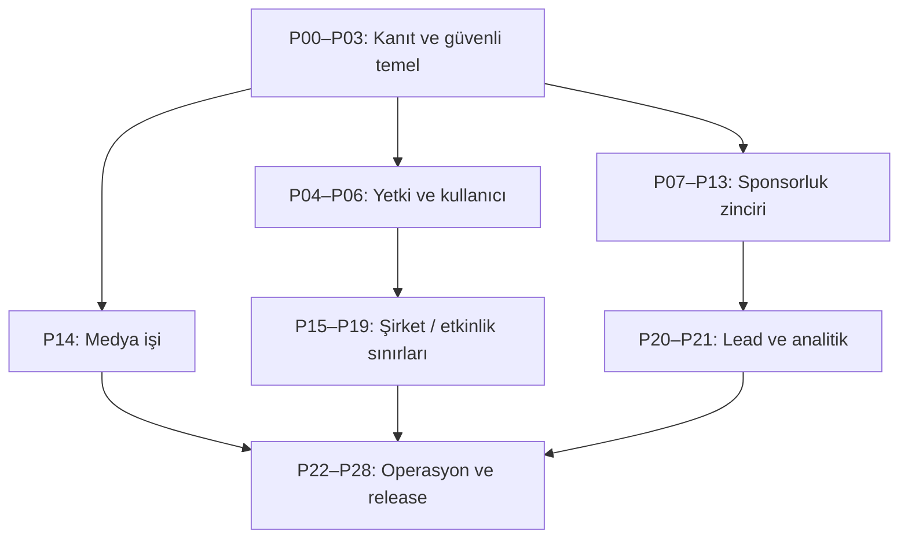

# Maven Event Management v2
## Kanıta Dayalı Teknik Değerlendirme, Sektör Kıyaslaması ve Google Antigravity Uygulama Yol Haritası

**İnceleme tarihi:** 28 Eylül 2026  
**İncelenen depo:** `ardaazmus/EVENT-MANAGEMENT-v2`  
**Sabitlenen commit:** [`28acc8c907c95b6c89ef09be27346811f4bca3b2`](https://github.com/ardaazmus/EVENT-MANAGEMENT-v2/tree/28acc8c907c95b6c89ef09be27346811f4bca3b2)  
**İncelenen ek belge:** “Maven Event Management v2 — Kapsamlı Araştırma, Hata Raporu(1).md”  
**Amaç:** Antigravity'nin yapılmamış işi yapılmış göstermesini, varsayıma dayalı kod üretmesini ve büyük/kontrolsüz değişiklikler yapmasını engelleyen; her küçük değişiklikten sonra test ve kanıt zorunlu olan yürütülebilir plan.

---

## 1. Yönetici özeti

Maven Event Management v2 sıradan bir prototip değildir. 103 Prisma modeli, 106 API route dosyası, 26 modül ve 36 Playwright spec dosyasıyla; kayıt, bilimsel değerlendirme, program, sponsorluk, finans, konaklama, saha operasyonu, portal, iletişim, medya ve SaaS yönetimini aynı üründe toplamaya çalışan geniş bir PCO/etkinlik operasyon çekirdeğidir.

Ancak ürün bugün **“enterprise-ready” olarak kabul edilmemelidir**. Bunun temel nedeni özellik sayısı değil; güvenlik yetkilendirmesinin sunucuda tamamlanmamış olması, sponsorluk akışının veri modeliyle çelişmesi, üretim kimlik doğrulamasının varsayılan olarak kapalı olması, test zincirinin yeşil görünmesine rağmen tip kontrolünü kapsamaması ve CI/migration/reprodüksiyon temellerinin eksik olmasıdır.

### Karar özeti

| Alan | Karar | Gerekçe |
|---|---|---|
| Ürün kapsamı | Güçlü çekirdek | PCO iş alanlarının çoğu modellenmiş |
| Veri izolasyonu | Kısmen güçlü | Tenant/edition guard mevcut; nesne ve eylem yetkisi eksik |
| Yetkilendirme | Yayına engel | Generic CRUD uçlarında sunucu tarafı modül/eylem kontrolü yok |
| Sponsorluk | Yayına engel | Yeni anlaşma 400, statü taksonomisi bozuk, tutar 100× yanlış, kapasite uygulanmıyor |
| Kalite kapıları | Yayına engel | `tsc`, ESLint, i18n başarısız; CI yok; build tip kontrolünü atlıyor |
| Operasyon | Yüksek risk | SQLite çalışma dosyaları takipte, migration geçmişi yok, dış medya export'u senkron fetch yapıyor |
| Sektörel uyum | Orta | Temel süreçler geniş; sponsor ROI, exhibitor self-service, cross-event analytics, erişilebilirlik ve yönetişim geride |
| Önerilen yaklaşım | Kontrollü iyileştirme | Yeniden yazım değil; P00–P28 arasında 29 küçük, bağımsız, geri alınabilir faz grubu |

### İlk beş öncelik

1. Üretimi fail-closed yap: kimlik doğrulama kapalıysa uygulama üretimde başlamasın.
2. Generic CRUD'a merkezi sunucu yetkilendirmesi ekle; UI gizlemesini güvenlik sayma.
3. Sponsorluk oluşturma/statü/para birimi hatalarını birlikte düzelt ve sözleşme testleriyle kilitle.
4. Reprodüksiyon ve CI temelini kur: kilit dosyası, migration, izole test DB, `typecheck`, lint, i18n, API ve tarayıcı kapıları.
5. Senkron dış-URL medya indirmeyi export yolundan çıkar; kontrollü ingestion veya URL manifesti kullan.

---

## 2. İnceleme yöntemi ve doğruluk kuralları

### 2.1 Kanıt sınıfları

Bu raporda her iddia şu sınıflardan biriyle ele alınır:

- **DOĞRULANDI:** Kod, şema veya çalıştırılmış test doğrudan iddiayı gösteriyor.
- **DÜZELTİLDİ:** Ek rapordaki yön doğru, ayrıntı veya sayı güncel değil.
- **KISMEN:** Bulguda gerçek risk var fakat kapsamı/ifadesi fazla geniş.
- **YENİ:** Ek raporda bulunmayan, bu incelemede kanıtlanan risk.
- **ERTELENDİ:** Ortam veya dış sistem olmadan doğrulanamayan konu; tamamlandı sayılamaz.

### 2.2 Kanıt önceliği

1. Sabit commit'teki kaynak kod ve Prisma şeması.
2. Temiz klonda aynı commit üzerinde çalıştırılan komut çıktısı.
3. Üretici/rakiplerin resmî ürün sayfaları.
4. OWASP, W3C, PCI SSC, ISO, KVKK, İYS ve IAPCO gibi birincil standart/mevzuat kaynakları.
5. Yorum veya çıkarım; açıkça “çıkarım” diye işaretlenir.

### 2.3 “Tamamlandı” kelimesinin kullanım şartı

Bir Antigravity fazı ancak aşağıdakilerin tamamı varsa tamamlanmış sayılır:

- Beklenen dosya diff'i mevcut.
- Fazın negatif ve pozitif kabul testleri çalışmış.
- Komut, exit code, test sayısı ve süre kayıt altında.
- Kanıt manifesti oluşturulmuş.
- Başarısız/atlanmış test yok veya açıkça onaylanmış istisna kaydı var.
- Çalışma ağacı yalnız faza ait değişiklikleri içeriyor.
- Sonraki faza geçiş kapısı yazılı olarak `PASS`.

“Kod yazıldı”, “muhtemelen çalışır”, “build geçti”, ekran görüntüsü veya Antigravity'nin kendi açıklaması tek başına kanıt değildir.

---

## 3. Mevcut mimari envanteri

### 3.1 Teknik temel

| Katman | Gözlenen durum |
|---|---|
| Uygulama | Next.js 16 App Router, React 19, TypeScript |
| Veri | Prisma 6 + SQLite |
| Arayüz | Tailwind CSS, Radix tabanlı bileşenler, Lucide ikonları |
| Test | Playwright; 36 spec, listede 204 test |
| Dağıtım | Next standalone çıktısı, Bun ile başlatma |
| Kimlik | HMAC oturum çerezi, TOTP/MFA parçaları, `MAVEN_AUTH` bayrağı |
| Tenant izolasyonu | Registry + `tenant-guard` üzerinden tenant/edition scope |
| İş alanları | kayıt, kişi/kurum, bilimsel kurul, program, sponsorluk, finans, konaklama, saha, portal, medya, iletişim, görevler, SaaS |

`package.json` sürümleri caret ile tanımlı; `packageManager` ve `engines` alanları yoktur. Testte kurulan Next sürümünün manifestteki taban sürümden ileride olması, kilit dosyası olmadan aynı commit'in farklı zamanda farklı bağımlılıklarla çalışabileceğini gösterir.

### 3.2 Kapsam modeli

Kod, `people`, `organizations` ve `customer-contacts` verilerini tenant çapında; sponsor anlaşmaları, kayıtlar, formlar, finans, bilimsel/program ve saha nesnelerini edition çapında ele alıyor. Bu ayrım altyapı bakımından anlamlıdır; fakat ürün deneyiminde “şirket CRM havuzu” ve “etkinliğe atanmış kişiler” ayrı görünümler olarak sunulmadığı için kullanıcı bağlamı bulanıklaşmaktadır.

Kanıt: [`tenant-guard.ts#L18-L39`](https://github.com/ardaazmus/EVENT-MANAGEMENT-v2/blob/28acc8c907c95b6c89ef09be27346811f4bca3b2/src/lib/api/tenant-guard.ts#L18-L39), [`tenant-guard.ts#L41-L78`](https://github.com/ardaazmus/EVENT-MANAGEMENT-v2/blob/28acc8c907c95b6c89ef09be27346811f4bca3b2/src/lib/api/tenant-guard.ts#L41-L78).

### 3.3 Güvenlik sınırı

Middleware oturum doğrulaması yapıyor; `request-context.ts` staff/admin yardımcıları sunuyor. Fakat generic `[entity]` ve `[entity]/[id]` CRUD route'ları bunları modül/eylem düzeyinde uygulamıyor. Sonuç: tenant izolasyonu var, ancak aynı tenant içindeki farklı görev sahiplerinin “görüntüle/oluştur/değiştir/sil/dışa aktar/onayla” ayrımı sunucuda kapalı değildir.

Kanıt: [`request-context.ts#L15-L59`](https://github.com/ardaazmus/EVENT-MANAGEMENT-v2/blob/28acc8c907c95b6c89ef09be27346811f4bca3b2/src/lib/auth/request-context.ts#L15-L59), [`[entity]/route.ts#L36-L151`](https://github.com/ardaazmus/EVENT-MANAGEMENT-v2/blob/28acc8c907c95b6c89ef09be27346811f4bca3b2/src/app/api/%5Bentity%5D/route.ts#L36-L151), [`[entity]/[id]/route.ts#L47-L151`](https://github.com/ardaazmus/EVENT-MANAGEMENT-v2/blob/28acc8c907c95b6c89ef09be27346811f4bca3b2/src/app/api/%5Bentity%5D/%5Bid%5D/route.ts#L47-L151).

---

## 4. Ek Markdown raporundaki H-01…H-20 bulgularının değerlendirmesi

| ID | Karar | Güncel kanıt ve değerlendirme | Öncelik |
|---|---|---|---|
| H-01 | DOĞRULANDI | UI yeni anlaşmada zorunlu `organizationId` göndermiyor; şema alanı zorunlu. POST 400 kaçınılmaz. [`sponsorship.tsx#L178-L186`](https://github.com/ardaazmus/EVENT-MANAGEMENT-v2/blob/28acc8c907c95b6c89ef09be27346811f4bca3b2/src/components/maven/views/sponsorship.tsx#L178-L186), [`schema.prisma#L903-L919`](https://github.com/ardaazmus/EVENT-MANAGEMENT-v2/blob/28acc8c907c95b6c89ef09be27346811f4bca3b2/prisma/schema.prisma#L903-L919) | P0 |
| H-02 | DOĞRULANDI | UI `LEAD/PROPOSAL/CONTRACT/PAID`, DB `PROSPECT/NEGOTIATION/CONTRACTED/ACTIVE/COMPLETED/CANCELLED` kullanıyor. Drag-drop geçersiz durum yazabiliyor. [`sponsorship-kanban.tsx#L40-L45`](https://github.com/ardaazmus/EVENT-MANAGEMENT-v2/blob/28acc8c907c95b6c89ef09be27346811f4bca3b2/src/components/maven/sponsorship/sponsorship-kanban.tsx#L40-L45), [`schema.prisma#L909-L912`](https://github.com/ardaazmus/EVENT-MANAGEMENT-v2/blob/28acc8c907c95b6c89ef09be27346811f4bca3b2/prisma/schema.prisma#L909-L912) | P0 |
| H-03 | DOĞRULANDI | Tier/package modelleri ve kapasite alanı var; Kanban seçenekleri sabit ve kapasiteyi atomik uygulayan domain kontrolü yok. [`schema.prisma#L873-L901`](https://github.com/ardaazmus/EVENT-MANAGEMENT-v2/blob/28acc8c907c95b6c89ef09be27346811f4bca3b2/prisma/schema.prisma#L873-L901), [`sponsorship-kanban.tsx#L54-L57`](https://github.com/ardaazmus/EVENT-MANAGEMENT-v2/blob/28acc8c907c95b6c89ef09be27346811f4bca3b2/src/components/maven/sponsorship/sponsorship-kanban.tsx#L54-L57) | P1 |
| H-04 | DOĞRULANDI | `roleCanSee` yalnız shell navigasyonunu filtreliyor; güvenlik sınırı değil. Generic CRUD'da action-level izin yok. [`constants.ts#L498-L505`](https://github.com/ardaazmus/EVENT-MANAGEMENT-v2/blob/28acc8c907c95b6c89ef09be27346811f4bca3b2/src/lib/constants.ts#L498-L505), [`shell.tsx#L45-L56`](https://github.com/ardaazmus/EVENT-MANAGEMENT-v2/blob/28acc8c907c95b6c89ef09be27346811f4bca3b2/src/components/maven/shell.tsx#L45-L56) | P0 |
| H-05 | DOĞRULANDI | Ayarlarda dil/tenant kimliği var; kullanıcı davet, devre dışı bırakma, rol ve edition atama yönetimi yok. | P1 |
| H-06 | DÜZELTİLDİ | `CustomRole.permissions` tamamen “dekoratif” değildir: People UI'da görüntülenip düzenlenir. Fakat API kararlarına bağlanmadığı için **authorization-dead** durumdadır. Sorun veri girişi değil, enforcement eksikliğidir. | P0 |
| H-07 | DOĞRULANDI | People/organizations tenant havuzundan listeleniyor; etkinliğe atanmış kişi görünümü ayrı değil. Bu veri modelinde hata değil, UX ve sorgu sınırı eksiğidir. [`people.tsx#L879-L904`](https://github.com/ardaazmus/EVENT-MANAGEMENT-v2/blob/28acc8c907c95b6c89ef09be27346811f4bca3b2/src/components/maven/views/people.tsx#L879-L904) | P1 |
| H-08 | KISMEN | Şirket CRM/iletişim kabiliyeti ile edition kampanyalarının ayrılması gerekir. Mevcut capability kapısının her iletişim use-case'ine uygulanması bağlam sızıntısı yaratıyor; ancak tüm iletişim verisini şirket çapına taşımak da yanlış olur. | P1 |
| H-09 | DOĞRULANDI | Admin/şirket seviyesinde light/dark/system tema yönetimi yok. Event portalında accent/theme alanlarının bulunması bunu karşılamıyor. Root layout tema sağlayıcısı kurmuyor. [`layout.tsx#L1-L55`](https://github.com/ardaazmus/EVENT-MANAGEMENT-v2/blob/28acc8c907c95b6c89ef09be27346811f4bca3b2/src/app/layout.tsx#L1-L55) | P2 |
| H-10 | DOĞRULANDI | Şirket arşivi, veri kasası, saklama politikası, merkezi import/export merkezi görünmüyor. Media export tek başına kurumsal data vault değildir. | P2 |
| H-11 | DOĞRULANDI | Sosyal/promosyon planı edition ağırlıklı; kurumsal marka varlıkları ve tekrar kullanılabilir kampanya şablonları eksik. | P2 |
| H-12 | DOĞRULANDI | `npx tsc --noEmit`, `mini-services/live-bus/index.ts` içindeki eksik `socket.io` nedeniyle 1 hata ile başarısız. Build'in geçmesi bu hatayı geçersiz kılmaz; build çıktısı tip kontrolünü atlıyor. | P0 |
| H-13 | DOĞRULANDI | ESLint güncel çalıştırmada 39 error, 1 warning üretti. Bazıları biçimsel değil; hook sırası/closure davranışı riski taşıyor. | P0 |
| H-14 | DÜZELTİLDİ | Ek rapordaki 21 sayısı eskimiş. Güncel `npm run i18n:scan` **35 ihlal** ile başarısız. | P1 |
| H-15 | DOĞRULANDI | Doküman, model sayıları, sürüm ve gerçekleşen kalite durumu drift ediyor. Doküman doğrulaması CI'a bağlı değil. | P1 |
| H-16 | DÜZELTİLDİ | İncelenen ortamda üretim build'i geçti; font kaynaklı çökme tekrarlanmadı. Buna karşın Next middleware deprecation ve dinamik `fs` tracing uyarıları var. “Build kırık” yerine “build yeşili eksik ve uyarılı” denmelidir. | P1 |
| H-17 | DOĞRULANDI | `.dependency-cruiser.cjs` var, paket/script yok; mimari sınır testi çalıştırılamıyor. | P1 |
| H-18 | DOĞRULANDI | B2B eşleşme ekranında gerçek veriymiş gibi sunulan sabit şirket/puan örnekleri var. [`sponsorship-kanban.tsx#L202-L265`](https://github.com/ardaazmus/EVENT-MANAGEMENT-v2/blob/28acc8c907c95b6c89ef09be27346811f4bca3b2/src/components/maven/sponsorship/sponsorship-kanban.tsx#L202-L265) | P1 |
| H-19 | DOĞRULANDI | Stand tahsisi organizasyonun ilk `CONTRACTED/ACTIVE` anlaşmasını seçiyor; seçim/uyuşmazlık kontrolü yok. [`sponsorship.tsx#L483-L487`](https://github.com/ardaazmus/EVENT-MANAGEMENT-v2/blob/28acc8c907c95b6c89ef09be27346811f4bca3b2/src/components/maven/views/sponsorship.tsx#L483-L487) | P1 |
| H-20 | DÜZELTİLDİ | Testler artık çalıştırıldı. Temiz klonda seçili çekirdek API paketi 75/75 geçti. Fakat tam UI paketi Chromium eksikliği ve test sunucusu/DB izolasyonu sorunları nedeniyle doğrulanmış değildir; “tüm testler yeşil” denemez. | P0 altyapı |

### 4.1 Ek raporda olmayan kritik yeni bulgular

#### N-01 — Üretimde auth kapalı açılabilme riski — P0

`MAVEN_AUTH` tam olarak `on` değilse `AUTH_ENABLED=false`; `hasSession()` doğrudan `true` döndürüyor. Demo davranışı için anlaşılır olsa da üretimde bir environment değişkeninin unutulması sistemi fail-open yapar.

Kanıt: [`auth-flag.ts#L1-L15`](https://github.com/ardaazmus/EVENT-MANAGEMENT-v2/blob/28acc8c907c95b6c89ef09be27346811f4bca3b2/src/lib/auth-flag.ts#L1-L15), [`middleware.ts#L52-L54`](https://github.com/ardaazmus/EVENT-MANAGEMENT-v2/blob/28acc8c907c95b6c89ef09be27346811f4bca3b2/src/middleware.ts#L52-L54).

**Doğru çözüm:** `NODE_ENV=production` ve açık bir `MAVEN_DEMO_MODE=on` istisnası yoksa auth-off başlangıçta fatal hata vermeli. Bu kontrol request sırasında değil, konfigürasyon yüklenirken test edilmeli.

#### N-02 — Sponsor tutarı 100× yanlış kaydediliyor — P0

Ürün kuralı DB'de paranın minor unit/kuruş olarak tutulmasıdır. Muhasebe ve konaklama girişleri `toMinor()` kullanır. Sponsor formu ise kullanıcının TL olarak girdiği `deal.amount` değerini doğrudan DB alanına yollar. Örneğin kullanıcı `250000` TL yazdığında `250000` kuruş, yani 2.500 TL saklanır. Toast ise 250.000 TL gösterir; veri ile kullanıcı kanıtı çelişir.

Kanıt: [`money.ts#L1-L28`](https://github.com/ardaazmus/EVENT-MANAGEMENT-v2/blob/28acc8c907c95b6c89ef09be27346811f4bca3b2/src/lib/money.ts#L1-L28), [`sponsorship.tsx#L178-L187`](https://github.com/ardaazmus/EVENT-MANAGEMENT-v2/blob/28acc8c907c95b6c89ef09be27346811f4bca3b2/src/components/maven/views/sponsorship.tsx#L178-L187), [`schema.prisma#L903-L911`](https://github.com/ardaazmus/EVENT-MANAGEMENT-v2/blob/28acc8c907c95b6c89ef09be27346811f4bca3b2/prisma/schema.prisma#L903-L911).

#### N-03 — Media export'ta senkron dış URL fetch: SSRF/DoS yüzeyi — P0/P1

Export route'u HTTP(S) medya URL'lerini ZIP hazırlarken sunucudan tek tek indiriyor. Literal localhost/private-IP kontrolleri var; fakat DNS çözümünden sonra private IP doğrulaması, redirect zinciri doğrulaması, global iş bütçesi ve toplam byte kotası görünmüyor. Her URL için 8 saniye beklenebildiğinden toplam süre varlık sayısıyla büyüyor. Ayrı çalıştırılan media-export testi 60 saniye timeout oldu.

Kanıt: [`media/export/route.ts#L15-L37`](https://github.com/ardaazmus/EVENT-MANAGEMENT-v2/blob/28acc8c907c95b6c89ef09be27346811f4bca3b2/src/app/api/media/export/route.ts#L15-L37), [`media/export/route.ts#L112-L149`](https://github.com/ardaazmus/EVENT-MANAGEMENT-v2/blob/28acc8c907c95b6c89ef09be27346811f4bca3b2/src/app/api/media/export/route.ts#L112-L149).

**Doğru çözüm:** Export sırasında keyfi uzak URL indirme. Ya `.url` manifesti üret ya da URL'yi yükleme anında allowlist'li, DNS/IP yeniden doğrulayan, redirect/byte/MIME/time limitli asenkron ingestion işine al; export yalnız güvenilir object storage'dan okusun.

#### N-04 — Reprodüksiyon ve veri yaşam döngüsü eksikleri — P0

- GitHub workflow görünmüyor.
- `prisma/migrations` geçmişi yok.
- `.env`, `db/custom.db`, `db/custom.db-shm`, `db/custom.db-wal` takipte.
- `db:push` script'i `--accept-data-loss` kullanıyor.
- Lockfile yok; package manager/engine sabit değil.
- Playwright config test sunucusunu otomatik başlatan `webServer` tanımıyla standardize edilmemiş.

Bu durumlar tek tek “açık” olmak zorunda değildir; fakat birlikte üretim verisi, migration geri dönüşü, CI tekrarlanabilirliği ve gizli veri hijyeni için kabul edilemez bir temel oluşturur.

#### N-05 — Build yeşili yanlış güven verebilir — P0

`next build` geçti, fakat çıktı tip doğrulamasının atlandığını belirtti. Aynı commit'te `npx tsc --noEmit` hata verdi. Bu nedenle build, tek başına merge/release kapısı olamaz.

---

## 5. Çalıştırılmış doğrulamalar

| Kontrol | Sonuç | Yorum |
|---|---|---|
| `next build` | PASS | 87 route üretildi; middleware deprecation ve dinamik `fs` tracing uyarısı var; typecheck kapsanmıyor |
| `npx tsc --noEmit` | FAIL | 1 hata: `mini-services/live-bus/index.ts`, eksik `socket.io` |
| `npm run lint` | FAIL | 39 error, 1 warning |
| `npm run i18n:scan` | FAIL | 35 hard-coded metin ihlali |
| Dependency-cruiser | ÇALIŞMADI | Paket/script yok; exit 127 |
| `playwright test --list` | PASS | 204 test, 36 spec |
| Temiz klon seçili core API testleri | PASS | 75/75, yaklaşık 16,4 sn |
| Media export güvenlik testi | FAIL/TIMEOUT | 60 sn; dış URL export akışının kaynak bütçesi sorunu |
| Tam tarayıcı E2E | ERTELENDİ | Chromium binary yok; otomatik test sunucusu/DB izolasyonu standardize değil |

**Önemli yorum:** 75/75 sonucu yalnız çalıştırılan API çekirdeğini kanıtlar. UI, erişilebilirlik, gerçek auth-on matrisi, offline davranış ve tüm E2E paketi hakkında “geçti” sonucu vermez.

---

## 6. Sektör ve rakip analizi

Bu kıyaslama pazarlama skorlaması değildir. Yalnız rakiplerin resmî sayfalarında açıkça sunduğu yetenekler sektör beklentisi olarak kullanılmıştır.

### 6.1 Rakiplerden görülen sektör kalıpları

| Ürün | Resmî olarak öne çıkan yetenekler | Maven için doğrulanan ders |
|---|---|---|
| Cvent | Registration, session capacity/waitlist, speaker/exhibitor yönetimi, mobil uygulama, OnArrival check-in/badge, lead capture ve analytics | Registration + onsite + exhibitor + analytics tek veri hattı olmalı; saha verisi sonradan kopyalanmamalı |
| RainFocus | Sponsor activation, paket yönetimi, sponsor portalı, lead retrieval ve gerçek zamanlı analytics | Sponsorluk yalnız anlaşma/deliverable değil; self-service, lead kanıtı ve ROI raporu gerektirir |
| EventsAir | Registration, content/speaker, budget, travel/accommodation, sponsor ve canlı operasyon dashboard'u | Maven'ın PCO genişliği doğru; eksik olan süreçler arası güvenilir kontrol ve operasyon dashboard kanıtı |
| Stova | Enterprise registration, mobile/touchless onsite, session scanning, access control ve badging | Onsite çevrimdışı dayanıklılık, erişim kuralları ve cihaz operasyonları birinci sınıf ürün alanıdır |
| Swapcard | Exhibitor marketplace, AI matching, meeting, lead scoring ve sponsor ROI | Sabit “AI eşleşme” demosu yerine açıklanabilir gerçek veri, opt-out ve ölçülebilir sonuç gerekir |
| Bizzabo | Central command, onsite data, check-in, sponsor portalı ve ROI raporlama | Yönetici görünümü bütün etkinlik yaşam döngüsünü gerçek zamanlı birleştirmelidir |
| EventMobi | Registration, exhibitor portal, app, check-in ve multi-event management | Portföy düzeyi varlıkların edition varlıklarından ayrılması gerekir |
| Swoogo | Kurumsal registration, white-label, conditional logic, API, cross-event data, SSO/MFA/RBAC ve güvenlik sertifikasyonları | “Enterprise” iddiası özellik kadar erişim kontrolü, tenant governance ve doğrulanabilir güvenlik gerektirir |

### 6.2 Maven'ın sektörel olgunluk haritası

| Yetenek | Mevcut durum | Sektörel hedef |
|---|---|---|
| Portföy / multi-event | Model ve dashboard parçaları var | Cross-event KPI, şablon, marka varlığı, kullanıcı kapsamı, arşiv |
| Registration/forms | Geniş model ve portal akışları var | Kural motoru, bekleme listesi, ücret/değişiklik audit'i, erişilebilir form tasarımı |
| Bilimsel süreç | Submission/review/session kapsamı güçlü | Conflict-of-interest, körleme kanıtı, sürümleme ve kurul audit'i |
| Program | Room/session/timetable var | Çakışma çözümü, kapasite, canlı değişiklik yayını, attendee agenda |
| Sponsorluk/exhibitor | Model geniş; UI akışı kırık | Sponsor portalı, paket kapasitesi, kontrat/tahsilat ayrımı, lead/ROI |
| Onsite | Check-in, badge, scan parçaları var | Offline queue, idempotency, cihaz yönetimi, erişim kontrolü, anlık dashboard |
| Konaklama/seyahat | Güçlü başlangıç | Room block, pickup, manifest, değişiklik/no-show finans uzlaşması |
| Finans | Minor-unit yaklaşımı doğru | Payment provider abstraction, iade/chargeback, muhasebe export, tam audit |
| İletişim | Kampanya ve şablonlar var | Consent purpose, İYS senkronu, suppression, teslimat/şikâyet audit'i |
| Analytics | Çeşitli dashboard'lar var | Tanımlı metrik kataloğu, veri tazeliği, cross-event ve sponsor ROI |
| Güvenlik | Session/MFA/tenant guard parçaları var | Fail-closed, API-level RBAC/ABAC, secrets, audit, dependency ve security gates |
| Erişilebilirlik | Sistematik kanıt yok | WCAG 2.2 AA otomasyon + klavye/screen-reader manuel kabul |
| Sürdürülebilirlik | Sistematik alan görünmüyor | ISO 20121 hedef/ölçüm/tedarikçi/atık/seyahat göstergeleri |

### 6.3 Ürün konumlandırma önerisi

Maven kısa vadede “her rakibin her özelliğini kopyalayan platform” olmamalı. En savunulabilir konum:

> **Türkiye ve bölgesel PCO'lar için; bilimsel kongre, konaklama, saha ve sponsor gelir operasyonlarını tek edition veri modeli üzerinde birleştiren, denetlenebilir etkinlik işletim sistemi.**

Bu konumun kanıtlanması için üç değer zinciri eksiksiz çalışmalıdır:

1. **Kayıt → ödeme → badge → check-in → katılım → sertifika**
2. **Sponsor paketi → sözleşme → tahsilat → stand/teslimat → lead → ROI**
3. **Abstract → review → karar → program → oturum taraması → CME/sertifika**

Her zincirin uçtan uca E2E testi ve audit trail'i olmadan sektör sunumunda “hazır” denmemelidir.

---

## 7. Hedef mimari ilkeleri

### 7.1 Company, event ve platform sınırları

| Kapsam | Sahip olduğu veriler | Sahip olmaması gerekenler |
|---|---|---|
| Platform | Tenant provision, plan/limit, sistem sağlık, global güvenlik politikaları | Müşteri etkinlik içeriğini varsayılan okuma |
| Company/Tenant | Kullanıcı, rol, kurum/kişi master, marka, entegrasyon, consent/suppression, şablon, saklama politikası | Edition'a özgü program/finans/sponsor icrası |
| Event edition | Kayıt, program, submission, sponsor anlaşması, stand, rezervasyon, badge, scan, kampanya icrası | Global kullanıcı veya master CRM kaydını kopya kimlikle çoğaltma |

### 7.2 Yetkilendirme tasarımı

Tek bir `role` string'i ve UI modül gizleme, hedef mimari için yetersizdir. Önerilen minimum yapı:

- `RoleDefinition`: tenant'a ait veya sistem rolü.
- `RolePermission`: `module`, `action`, `scopeType` (`TENANT`/`EDITION`), gerekirse `conditionJson`.
- `UserRoleAssignment`: user + role + **non-null** `scopeKey` (`TENANT` veya edition id). SQLite'ta nullable unique davranışına güvenilmemeli.
- Merkezi `authorize({actor, module, action, editionId, resource})`.
- Registry entity'si → module/action eşlemesi; bilinmeyen entity **deny-by-default**.
- Row ownership/approval gibi özel kurallar generic route sonrasında domain policy ile uygulanmalı.
- Audit log: actor, tenant, edition, action, resource type/id, before/after hash, request id.

OWASP'ın önerdiği gibi erişim kontrolü her endpoint'te uygulanmalı; yalnız URL gizlemek veya UI filtresi güvenlik kontrolü sayılmamalıdır.

### 7.3 Sponsorluk domain'i

Önerilen durum makinesi:

`PROSPECT → NEGOTIATION → CONTRACTED → ACTIVE → COMPLETED`

Yan yol: `PROSPECT|NEGOTIATION|CONTRACTED|ACTIVE → CANCELLED`. Geri geçişler yalnız yetkili “reopen” komutuyla ve gerekçeyle yapılır. `PAID` sponsorluk yaşam döngüsü durumu değildir; finansal ödeme/receivable durumudur.

Kurallar:

- Anlaşma organizasyonsuz oluşturulamaz.
- UI mevcut organizasyon seçer veya ayrı açık eylemle yeni organizasyon yaratır.
- `amount` API sözleşmesi açıkça `amountMinor`; kullanıcı girdisi `toMinor()` ile çevrilir.
- Tier/package edition'a ait olmalı ve currency uyumu kontrol edilmeli.
- Tier kapasitesi transaction içinde sayılıp uygulanmalı; yarış koşulu testi yapılmalı.
- Booth allocation açıkça anlaşma seçmeli; “ilk uygun anlaşma” yok.
- `CONTRACTED` olmadan kesin stand tahsisi; `ACTIVE` olmadan sponsor portalı aktivasyonu yapılamamalı.
- Sponsor deliverable, lead ve meeting verisi anlaşma ile izlenebilir olmalı.

### 7.4 Dış medya ve entegrasyon işleri

Uzun süren veya ağ erişimli işler HTTP isteği içinde zincirlenmemeli:

- `Job` + `OutboxEvent` modeli.
- İdempotency key.
- Retry/backoff ve dead-letter durumu.
- Per-tenant kota.
- URL ingestion için scheme/host allowlist, DNS resolve sonrası public IP kontrolü, redirect tekrar kontrolü, content-length ve stream byte limiti, MIME sniffing, malware taraması.
- Export job yalnız güvenilir yerel/object-store nesnelerini paketler; durum ve kanıt indirilebilir.

---

## 8. Google Antigravity çalışma sözleşmesi

Aşağıdaki sözleşme her fazın başında Antigravity'ye verilmelidir.

### 8.1 Değişmez kurallar

1. Yalnız aktif faz üzerinde çalış; sonraki fazın kodunu “kolaylık olsun” diye ekleme.
2. Başlamadan önce `git status --short`, commit SHA ve hedef dosyaları kaydet.
3. Mevcut davranışı en az bir karakterizasyon testiyle sabitlemeden refactor yapma.
4. Önce başarısız kabul testi ekle; test yanlış sebeple kırılıyorsa üretim koduna geçme.
5. Bir faz en fazla 8 üretim dosyası veya 400 net satır değiştirsin. Aşarsa alt faza böl.
6. Şema değişikliği additive migration ile yapılır; `db push --accept-data-loss` yasaktır.
7. Binary SQLite dosyalarını, `.env`, WAL/SHM veya test artifact'lerini commit etme.
8. Mock/demo içeriğini gerçek özellikmiş gibi sunma. Demo veri varsa açık `DEMO` etiketi ve feature flag zorunlu.
9. Atlanan test, timeout, console error, lint/type error varken `PASS` yazma.
10. “Build geçti” ifadesini typecheck/lint/test yerine kullanma.
11. Kaynakta olmayan field, endpoint, rakip özelliği veya mevzuat gereği uydurma; belirsizlikte `UNKNOWN` yaz ve dur.
12. Faz bitiminde diff, komutlar, sonuçlar, kanıt dosyaları ve kalan riskleri raporla; insan veya otomatik gate `PASS` vermeden sonraki faza geçme.

### 8.2 Zorunlu başlangıç çıktısı

```text
PHASE: Pxx.y
BASE_SHA: <git rev-parse HEAD>
SCOPE: <tek cümle>
IN_SCOPE_FILES: <liste>
OUT_OF_SCOPE: <liste>
ACCEPTANCE_TESTS: <liste>
KNOWN_UNKNOWN: <liste>
STATUS: READY | BLOCKED
```

### 8.3 Zorunlu bitiş çıktısı

```text
PHASE: Pxx.y
STATUS: PASS | FAIL | BLOCKED
CHANGED_FILES: <git diff --name-only>
TESTS:
  - command: <exact command>
    exit_code: <number>
    passed: <number>
    failed: <number>
    skipped: <number>
    duration_ms: <number>
EVIDENCE:
  - <artifact path + sha256>
REGRESSIONS: <none veya liste>
DEFERRED: <liste; neden + issue id>
NEXT_PHASE_ALLOWED: true | false
```

### 8.4 Kanıt manifesti

Her faz `artifacts/evidence/Pxx.y/manifest.json` üretmelidir:

```json
{
  "phase": "Pxx.y",
  "baseSha": "...",
  "headSha": "...",
  "startedAt": "ISO-8601",
  "finishedAt": "ISO-8601",
  "commands": [
    {"command": "...", "exitCode": 0, "stdoutFile": "...", "stderrFile": "..."}
  ],
  "tests": {"passed": 0, "failed": 0, "skipped": 0},
  "artifacts": [{"path": "...", "sha256": "..."}],
  "status": "PASS",
  "nextPhaseAllowed": true
}
```

Manifest üretimi test sonucu yerine geçmez; sonucu değiştirilemez kanıt zincirine bağlar.

### 8.5 Durdurma koşulları

Antigravity şu hallerde kod yazmayı durdurmalı ve `BLOCKED` vermelidir:

- Base SHA beklenenden farklı.
- Çalışma ağacında açıklanamayan kullanıcı değişikliği var.
- Faz için gereken iş kuralı iki anlama gelebiliyor.
- Migration veri kaybı öneriyor.
- Test yalnız ağ/credential/ödeme sağlayıcısı ile çalışabilir ve test doubles sözleşmesi tanımlı değil.
- Kabul testi güvenilir şekilde kırmızıya dönmüyor.
- Önceki fazın manifesti `PASS` değil.
- Güvenlik testi timeout oluyor veya kaynak bütçesi aşımı var.

---

## 9. Mikro-fazlı uygulama yol haritası

### Faz gruplarının bağımlılığı



Her ana faz aşağıdaki küçük adımlardan oluşur. Bir alt adım `PASS` olmadan sıradakine geçilmez.

### P00 — Baseline ve kanıt altyapısı

**P00.1 — Commit ve envanter sabitleme**

- Hedef: İnceleme/release tabanını SHA ile sabitlemek.
- Değişiklik: `docs/evidence/baseline.md`, envanter script'i.
- Test: Script aynı commit'te iki kez aynı model/route/spec sayısını üretmeli.
- Kanıt: SHA, Node/Bun/npm sürümü, OS, model/route/test sayısı, `git status`.
- Gate: Untracked runtime DB/artifact listesi açıkça raporlanmadan PASS yok.

**P00.2 — Gizli ve runtime dosya hijyeni**

- `.env` içeriğini repo dışına taşı; `.env.example` yalnız anahtar adları ve güvenli örnekler içersin.
- `db/*.db`, `*.db-wal`, `*.db-shm`, `test-results`, `playwright-report`, logları `.gitignore` kapsamına al.
- Takipten çıkarma işlemi mevcut kullanıcı verisini silmemeli; güvenli yedek prosedürü yazılmalı.
- Test: `git check-ignore` tablosu + secret scanner.
- Gate: Gerçek credential geçmişte varsa rotasyon issue'su açılmadan PASS yok.

**P00.3 — Tek komutluk kalite özeti**

- `scripts/quality-report.mjs`: typecheck, lint, i18n, unit/API/E2E listesini ayrı exit code'larla çalıştırır; başarısızlığı maskelemez.
- Script shell pipe/`tee` nedeniyle exit code kaybetmemeli.
- Test: Bilerek kırık fixture ile toplam komut non-zero olmalı.

### P01 — Reprodüksiyon ve CI

**P01.1 — Runtime sabitleme**

- Tek package manager seç; `packageManager`, `engines`, lockfile ekle.
- Next/Prisma sürüm çözümünü CI ve localde aynı yap.
- Test: Temiz temp klasörde frozen install.
- Gate: Lockfile değişmeden ikinci install diff üretmemeli.

**P01.2 — Eksik kalite script'leri**

- `typecheck`, `test:api`, `test:unit`, `test:e2e:ui`, `lint:arch`, `quality` script'leri.
- `socket.io` gerçekten live-bus runtime gereğiyse dependency ekle; değilse workspace/scope'u typecheck'ten bilinçli ayır ve gerekçesini belge.
- Test: `npm run typecheck` 0; eksik import fixture'ı non-zero.

**P01.3 — Migration tabanı**

- Mevcut şemadan kontrollü baseline migration oluştur.
- Üretimde `migrate deploy`; `db push --accept-data-loss` yalnız disposable dev DB için yeniden adlandırılsın.
- Test: Boş DB'ye migration + seed; var olan fixture DB kopyasına migration; schema diff boş.
- Rollback: DB snapshot; destructive rollback SQL otomatik çalıştırılmaz.

**P01.4 — CI workflow**

- İşler: frozen install → prisma generate → migration → typecheck → lint → i18n → arch → API → build → UI E2E.
- Her iş artifact yükler; branch protection gerekli işlere bağlanır.
- Test: CI config linter; kontrollü kırık PR'da job gerçekten kırılmalı.

### P02 — İzole test ortamı

**P02.1 — Her worker için ayrı DB**

- Playwright global setup benzersiz temp SQLite yolu üretir; migration/seed çalıştırır.
- Repo içindeki `db/custom.db` testte kullanılmaz.
- Test: Paralel iki koşu birbirinin kayıt sayısını etkilememeli.

**P02.2 — Otomatik web server ve tarayıcı**

- Playwright `webServer` tanımı; health endpoint; deterministic port.
- CI `playwright install --with-deps chromium`.
- Test: Temiz CI imajında manuel server olmadan smoke test.

**P02.3 — Auth matrisi**

- Ayrı projeler: `demo-auth-off`, `staff-auth-on`, `participant-auth-on`.
- Environment her projede açık; varsayıma bırakılmaz.
- Test: Aynı korumalı endpoint auth-off demo koşulunda belgelenen davranışı, auth-on koşulunda 401/403'ü vermeli.

### P03 — Fail-closed konfigürasyon

**P03.1 — Konfigürasyon şeması**

- `src/lib/config.ts` ile env doğrulaması.
- Production + auth-off + demo flag yok → process startup failure.
- Session secret minimum entropy/uzunluk kontrolü.
- Test: tablo testi; prod/dev/test kombinasyonları.

**P03.2 — Health/readiness ayrımı**

- Liveness yalnız proses; readiness DB/migration/config doğrular.
- Secret veya PII response'a/loga yazılmaz.
- Test: migration eksik DB readiness 503; sağlıklı DB 200.

### P04 — Merkezi sunucu yetkilendirmesi

**P04.1 — Yetki sözlüğü**

- 26 modül için action seti: `VIEW, CREATE, UPDATE, DELETE, EXPORT, APPROVE, MANAGE`.
- Entity→module/action map'i registry'ye ekle.
- Bilinmeyen entity için deny-by-default.
- Test: Tüm registry key'lerinin tam bir policy eşlemesi olmalı; snapshot/golden.

**P04.2 — Generic collection route koruması**

- GET→VIEW, POST→CREATE.
- Tenant/edition guard yetkiden sonra kaynak bağlamını doğrulamalı; hata mesajı başka tenant kaydının varlığını sızdırmamalı.
- Test: owner 200/201; viewer GET 200 POST 403; participant 403; tenant B id'si 404/403 politikası tutarlı.

**P04.3 — Generic item route koruması**

- GET→VIEW, PUT→UPDATE, DELETE→DELETE.
- Test: IDOR matrisi; doğrudan URL ve API istemcisi.

**P04.4 — Özel route envanteri**

- 106 route için public/staff/admin/domain policy tablosu.
- Route hiçbir sınıfa düşmüyorsa CI fail.
- Kanıt: `route-policy-report.json`.

### P05 — Kalıcı rol ve scope modeli

**P05.1 — Additive şema**

- `RoleDefinition`, `RolePermission`, `UserRoleAssignment` ekle.
- `scopeKey` non-null; tenant veya edition kimliği formatı doğrulanır.
- Migration yalnız create/index/add; eski alan silinmez.
- Test: aynı user/role/scope duplicate reddi; farklı edition kabulü.

**P05.2 — Statik rollerin seed edilmesi**

- Mevcut role sabitlerini sistem role'lerine deterministik taşı.
- Tekrar seed duplicate üretmemeli.
- Test: iki kez seed, aynı row count/hash.

**P05.3 — Çift okuma / geçiş**

- Önce yeni permission; bulunmazsa geçici legacy fallback ve telemetry.
- Fallback kullanımı metriklenir.
- Gate: Fallback sayısı sıfır olmadan legacy silme fazı açılmaz.

### P06 — Kullanıcı yönetimi ve edition ataması

**P06.1 — Read-only kullanıcı listesi**

- Tenant kullanıcıları; durum, MFA, son giriş, rol/scope özetleri.
- PII export değil; pagination ve filtre zorunlu.
- Test: tenant A hiçbir şekilde B'yi göremez.

**P06.2 — Davet ve etkinleştirme**

- Tek kullanımlık, süreli, hash saklanan invite token.
- Yeniden gönderme önceki tokenı iptal eder.
- Test: replay, expiry, cross-tenant, rate limit.

**P06.3 — Rol/scope atama**

- Owner'ın son owner'ı düşürmesini engelle.
- Kendine yetki yükseltme policy'sini açık tanımla.
- Test: privilege escalation negatif senaryoları.

**P06.4 — Devre dışı bırakma ve oturum iptali**

- User disable tüm aktif session'ları geçersiz kılar.
- Test: disable öncesi 200, sonrası aynı cookie 401.

### P07 — Sponsorluk oluşturma P0 düzeltmeleri

**P07.1 — API sözleşme testi**

- Önce tests: organization zorunlu; status enum; `amountMinor`; edition ownership.
- Mevcut kodda testler doğru sebeple kırmızı olmalı.

**P07.2 — Organizasyon seçimi**

- Yeni anlaşma modalı mevcut tenant organizasyonunu seçer.
- “Yeni kurum” ayrı dialog/endpoint ile oluşturulur; aynı isim eşleşmesi uyarı verir.
- `orgName` string'ini sessizce yeni kayıt sayma.

**P07.3 — Para birimi düzeltmesi**

- UI major TRY → `toMinor`; API alanını `amountMinor` yap veya şemayla açık sözleşme belgelenmiş `amount` minor kullan.
- Toast DB'den dönen kayıt `fmtMoney()` ile gösterilir.
- Test: 250000,00 TRY → 25000000 minor → UI ₺250.000,00; 0,01 → 1; negatif reddi; Int sınırı.

**P07.4 — Geçerli ilk durum**

- Yeni anlaşma yalnız `PROSPECT` veya policy ile `NEGOTIATION`.
- `LEAD` gönderimi 400; UI bu değeri göndermez.
- Gate: H-01, H-02 ve N-02 regression testleri yeşil.

### P08 — Sponsor durum makinesi

**P08.1 — Domain transition fonksiyonu**

- Saf `canTransition(from,to,actor,context)`.
- Tüm izinli/izinsiz çiftler tablo testi.

**P08.2 — PUT enforcement**

- Generic PUT ile status bypass edilemez; sponsor agreement özel validator/hook kullanır.
- `CONTRACTED` için signedAt/kontrat kanıtı politikası.
- Cancel/reopen gerekçe + audit.

**P08.3 — Kanban eşlemesi**

- UI ve DB aynı canonical durumları kullanır.
- Finansal `PAID` ayrı badge/KPI olarak ödeme verisinden gelir.
- Test: drag-drop sonrası reload aynı sütun; bilinmeyen statü sessizce PROSPECT'e düşmez.

### P09 — Tier ve paket görünürlüğü

**P09.1 — Read-only tier/package API tüketimi**

- Modal sabit Gold/Silver yerine edition verisini kullanır.
- Boş state ve loading/error açık.

**P09.2 — Paket hak özeti**

- Paket fiyatı minor unit, currency, tier ve rightsSpec güvenli gösterim.
- Test: başka edition package id'si reddedilir.

### P10 — Tier/package yönetimi ve kapasite

**P10.1 — Yetkili CRUD**

- SPONSORSHIP/MANAGE gerekir.
- Kullanımda olan tier hard delete edilmez; archive/disable düşünülür.

**P10.2 — Atomik kapasite**

- `CONTRACTED/ACTIVE` sayımı ve geçiş transaction içinde.
- SQLite write serialization dikkate alınır; ileride Postgres için constraint/locking tasarımı belgelenir.
- Test: kapasite 1'e iki paralel kontrat; yalnız biri 200, diğeri 409.

**P10.3 — Kapasite UX**

- `3/5 dolu`; son slot uyarısı; 409 sonrası refresh.
- UI ön kontrolü güvenlik değil; API son söz.

### P11 — Sponsor anlaşma sihirbazı

**P11.1** kurum seçimi.  
**P11.2** tier/package ve fiyat varsayımı; override ayrı izin.  
**P11.3** sözleşme tarih/not/dosya.  
**P11.4** özet ve idempotent create.

Her adım ayrı component testi alır; sihirbaz state'i API validasyonunu bypass edemez. Çift tıklama iki anlaşma üretmemeli.

### P12 — Stand tahsisi doğruluğu

**P12.1 — Anlaşma seçimini zorunlu yap**

- İlk aktif anlaşmayı otomatik seçme kaldırılır.
- Kurumun birden fazla uygun anlaşması varsa kullanıcı seçer.

**P12.2 — Domain kuralları**

- Booth edition, organization ve agreement edition eşleşmesi.
- Bir booth için aktif tahsis unique.
- Anlaşma statüsü ve entitlement kontrolü.
- Test: cross-edition, duplicate booth, cancelled agreement, concurrent allocation.

### P13 — Sahte B2B/AI verisini kaldırma

**P13.1 — Açık demo ayrımı**

- Sabit Novartis vb. kartları üretim modunda kaldır.
- Demo gerekiyorsa fixture/seed + “Demo veri” etiketi.

**P13.2 — Gerçek eşleşme MVP**

- Girdiler: opt-in, ilgi etiketleri, meeting availability.
- Deterministik ve açıklanabilir skor; “neden eşleşti” alanı.
- AI iddiası ancak model, veri, evaluation ve human override kanıtı varsa kullanılır.
- Test: opt-out kişi hiçbir öneride görünmez; aynı girdi aynı skor.

### P14 — Media export güvenliği ve iş kuyruğu

**P14.1 — Acil containment**

- Export dış URL'leri indirmek yerine `.url` manifestine yazar; feature flag ile güvenli varsayılan.
- Test: private/public URL için hiçbir outbound fetch çağrısı yapılmaz; export süre üst sınırı.

**P14.2 — Ingestion doğrulayıcısı**

- URL allowlist, DNS sonrası IP, redirect başına tekrar doğrulama, max redirect, timeout, byte/MIME limitleri.
- Test doubles ile IPv4/IPv6 loopback, RFC1918, link-local, redirect-to-private, oversized stream.

**P14.3 — Asenkron job**

- Request 202 + job id; worker download/tarama/store; retry/dead-letter.
- Test: idempotency, worker crash resume, tenant quota, cancellation.

**P14.4 — Export job**

- Yalnız trusted objects; progress; expiry; signed download.
- Test: 1.000 metadata varlığında süre/memory bütçesi.

### P15 — Tema ve şirket ayarları

**P15.1** `next-themes` provider; system/light/dark, hydration testi.  
**P15.2** user preference; tenant default ayrı.  
**P15.3** brand logo/color contrast kontrolü.  
**P15.4** portal teması ile admin temasını ayır.

Gate: refresh sonrası tercih korunur; system değişimi izlenir; kritik sayfalarda axe smoke.

### P16 — People/organization kapsam deneyimi

**P16.1 — Company Directory sekmesi**

- Tenant master kayıtları; yalnız yetkili roller.

**P16.2 — Event People sekmesi**

- Edition'a participation/assignment/registration ilişkisiyle bağlı kişiler.
- “Bu etkinliğe ekle” master kaydı kopyalamaz; ilişki oluşturur.

**P16.3 — Hızlı ekleme kuralları**

- E-posta normalize/dedupe; potansiyel eşleşmede birleştirme kararı.
- Test: tenant cross-leak, duplicate, edition remove master'ı silmez.

### P17 — İletişim, consent ve İYS

**P17.1 — Şirket/edition ayrımı**

- Company: provider, template library, suppression, consent source.
- Edition: campaign audience, send, delivery metrics.

**P17.2 — Consent purpose modeli**

- Transactional ve commercial ayrımı; source, timestamp, proof, withdrawal.
- Gönderim kararı immutable audit üretir.

**P17.3 — İYS adaptörü**

- Provider interface, sandbox/contract tests, retry/outbox, reconciliation.
- Hukuki yorum kod içine gömülmez; ürün sahibi/hukuk onayı gereken kurallar konfigüre edilir.
- Test: withdrawn contact commercial mesaj alamaz; zorunlu transactional akış ayrı policy ile sürer.

### P18 — Arşiv, saklama ve veri kasası

**P18.1 — Veri envanteri**: model→amaç→hukuki dayanak→saklama süresi→silme yöntemi.  
**P18.2 — Edition archive**: read-only snapshot; açık finans/iş varsa blok.  
**P18.3 — DSAR/export**: kişi bazlı JSON/CSV, yetkili ve audit'li.  
**P18.4 — Silme/anonimleştirme job'u**: dry-run, legal hold, referential integrity.  
**P18.5 — Restore drill**: yedek geri dönüş RPO/RTO ölçümü.

### P19 — Kurumsal promosyon ve varlık kütüphanesi

**P19.1** Tenant brand asset library; sürüm/hash/lisans bilgisi.  
**P19.2** Edition'a kopya değil referans + override.  
**P19.3** Kampanya şablonu, kanal ve onay workflow'u.  
**P19.4** Kullanım analitiği ve UTM sözlüğü.

### P20 — Sponsor/exhibitor self-service ve lead

**P20.1 — Sponsor portal erişimi**

- Agreement-scoped kullanıcı; yalnız kendi kurum/anlaşması.
- Logo/profil, personel, deliverable upload; approval workflow.

**P20.2 — Lead capture**

- Badge scan + açık consent purpose; offline idempotent queue.
- Sponsor yalnız kendi lead'ini görür; PII export audit ve expiry.

**P20.3 — Meetings**

- Availability, request/accept/decline, timezone ve çakışma.

**P20.4 — ROI raporu**

- Profil görüntüleme, favori, meeting, qualified lead, scan ve deliverable completion metrik tanımları.
- Vanity metric ile gelir sonucu karıştırılmaz; metrik freshness gösterilir.

### P21 — Analitik ve cross-event

**P21.1 — Metric catalog**

- Her KPI için isim, formül, grain, source, timezone, freshness, owner.

**P21.2 — Edition analytics API**

- Aynı metrik dashboard ve export'ta aynı fonksiyondan.

**P21.3 — Portfolio analytics**

- Yalnız izinli edition'lar; para birimi dönüşümü açık tarih/kaynakla.

**P21.4 — Sponsor benchmark**

- K-anonimlik eşiği; küçük gruplarda kıyas kapalı.

Test: Golden dataset üzerinde formül sonuçları; timezone/day boundary; refund/no-show/cancel senaryoları.

### P22 — Entegrasyon ve outbox

**P22.1** Outbox tablosu ve transaction ile event yazımı.  
**P22.2** Worker claim/lease/retry/dead-letter.  
**P22.3** Webhook signature, replay window, idempotency.  
**P22.4** Provider contract testleri; gerçek credential CI'da zorunlu değil.  
**P22.5** Operasyon ekranı: başarısız iş, retry, payload redaction.

### P23 — Erişilebilirlik ve i18n

**P23.1 — 35 i18n ihlalini küçük gruplar halinde sıfırla**

- Her alt PR en fazla bir modül; Türkçe/İngilizce key parity testi.

**P23.2 — Otomatik axe kapısı**

- Login, dashboard, registration, sponsorship, onsite, portal kritik yollar.

**P23.3 — Klavye/focus**

- Dialog focus trap/return, drag-drop alternatif kontrolleri, skip link.

**P23.4 — Manuel AT kabulü**

- NVDA/VoiceOver test senaryosu; otomasyon yerine geçmez.

Gate: WCAG 2.2 AA için bilinen istisnalar issue+owner+tarih olmadan release yok.

### P24 — Onsite PWA ve offline güvenilirlik

**P24.1** Installability/service worker sınırı; hassas API response cache edilmez.  
**P24.2** IndexedDB offline queue; scan idempotency key.  
**P24.3** Sync conflict policy: aynı badge/kapı/oturum.  
**P24.4** Cihaz oturumu, uzaktan revoke, clock skew.  
**P24.5** Offline→online chaos testi; sıra kaybı/çift tarama yok.

### P25 — ISO 20121 uyumlu sürdürülebilirlik çekirdeği

**P25.1** Hedef/kapsam/paydaş kaydı.  
**P25.2** Ölçüler: seyahat, enerji, atık, catering, tedarikçi kanıtı.  
**P25.3** Baseline/target/actual ve kanıt dosyası.  
**P25.4** Yönetim gözden geçirmesi ve iyileştirme aksiyonu.

Not: Yazılım sertifika vermez; standardın yönetim sistemi kanıtlarını destekler.

### P26 — Gözlemlenebilirlik, yedek ve felaket kurtarma

**P26.1** Structured log + request/tenant/edition/job correlation; PII redaction.  
**P26.2** SLI/SLO: API latency/error, queue age, email failure, check-in sync lag.  
**P26.3** Backup encryption/retention; restore automation.  
**P26.4** Quarterly restore drill; ölçülen RPO/RTO.  
**P26.5** Incident runbook ve audit export.

### P27 — Mimari sınırlar ve doküman doğruluğu

**P27.1** Dependency-cruiser paket/script ve mevcut config doğrulaması.  
**P27.2** Yasak import testleri: UI→DB, client→server secret, cross-domain cycle.  
**P27.3** README sayıları elle yazmak yerine envanter script'inden üretme.  
**P27.4** ADR: scope, auth, money, jobs, sponsor states.  
**P27.5** Public repo ile “Private & Proprietary” lisans ifadesini hukuk/owner kararıyla netleştirme.

### P28 — Release hardening ve pilot

**P28.1 — Üç altın yol E2E**

- Registration→payment→badge→check-in→certificate.
- Sponsor package→agreement→payment→booth/deliverable→lead→ROI.
- Abstract→review→decision→session→attendance→CME.

**P28.2 — Güvenlik kabulü**

- Auth/IDOR/tenant matrix; dependency/SAST/secret scan; media URL saldırı testleri.

**P28.3 — Performans bütçeleri**

- P95 API, dashboard load, 10k attendee search, concurrent check-in, export job memory.
- Test veri hacmi ve altyapı profili rapora yazılır; bağlamsız “hızlı” denmez.

**P28.4 — Pilot**

- İç demo değil; sınırlı gerçek etkinlik, feature flags, günlük reconciliation, rollback planı.
- Sev-1/Sev-2 tanımları, on-call ve veri kurtarma kontağı.

**P28.5 — Genel availability kararı**

- Açık P0=0, P1 için kabul edilmiş owner+tarih.
- Üç altın yol yeşil.
- Restore drill geçmiş.
- WCAG/KVKK/İYS/security checklist imzalı.
- Release manifest SHA ve artifact hash'leri yayımlanmış.

---

## 10. Faz başına standart test matrisi

| Katman | Her fazda minimum | Özellikle zorunlu olduğu alan |
|---|---|---|
| Unit | Saf kural için pozitif/negatif/boundary | money, status, permission, metrics |
| Schema/migration | boş DB + mevcut fixture + diff | her Prisma değişikliği |
| API contract | 2xx + validation 4xx + auth 401/403 + not-found | tüm route değişiklikleri |
| Tenant isolation | tenant A token + tenant B id | veri okuyan/yazan her API |
| Concurrency | iki paralel istek | kapasite, tahsis, ödeme, check-in, job claim |
| UI component | loading/empty/error/success | yeni ekran ve modal |
| E2E | kullanıcı sonucu ve reload sonrası kalıcılık | altın yollar |
| Accessibility | axe + klavye; kritiklerde manuel AT | tüm kullanıcı yüzleri |
| Security | input, IDOR, SSRF, replay, rate/quota | auth, media, webhook, export |
| Observability | request id, audit, redaction | mutation ve background job |
| Rollback | feature flag veya additive rollback doğrulaması | riskli iş akışları |

### Parasal veri için ek zorunlu testler

- `0`, `0.01`, `1.00`, `1,234.56`, `250000.00`, maksimum izinli tutar.
- Negatif, NaN, exponential notation, çok fazla ondalık.
- TRY ve farklı currency; format ile saklanan değer eşleşmesi.
- Refund/partial payment/rounding.
- Aynı değer form→API→DB→API→UI round-trip.

### Yetki için ek zorunlu test matrisi

| Aktör | Tenant scope | Edition scope | Beklenen |
|---|---|---|---|
| ORG_OWNER | kendi tenant | tüm edition'lar | policy dahilinde yönetim |
| ORG_ADMIN | kendi tenant | atanan/tümü kararı açık | owner-kritik eylemler hariç |
| Modül yöneticisi | kendi tenant | yalnız atanan edition | kendi modül action'ları |
| Read-only staff | kendi tenant | yalnız atanan edition | GET; mutation 403 |
| Participant/sponsor | kendi tenant | kendi kaynakları | portal-sınırlı; admin API 403 |
| Tenant B kullanıcısı | başka tenant | herhangi | veri varlığını sızdırmayan red |
| Oturumsuz | yok | yok | yalnız explicit public route |

---

## 11. Definition of Done

### 11.1 Bir mikro-faz için

- Kabul kriterleri test adıyla birebir izleniyor.
- Önce kırmızı, sonra yeşil kanıtı var.
- `typecheck`, etkilenen lint ve ilgili testler 0 exit.
- Yeni string'ler i18n kapsamlı.
- Yeni route policy envanterinde.
- Tenant/edition ve authorization negatif testleri var.
- PII/secrets loglanmıyor.
- Migration additive ve test edilmiş.
- Doküman/ADR gerekiyorsa aynı fazda güncel.
- Kanıt manifesti hash'li.
- Bilinen risk/defer listesi boş veya owner+tarih+issue ile açık.

### 11.2 Ürün release'i için

- Full frozen install ve build tekrarlanabilir.
- TypeScript, ESLint, i18n, architecture, API ve UI E2E tamamen yeşil.
- Atlanan test sayısı 0; gerçekten opsiyonelse açık allowlist ve gerekçe.
- Auth production fail-closed.
- Tüm route'lar policy sınıfında.
- Tenant isolation ve IDOR suite yeşil.
- Üç altın yol E2E yeşil.
- Backup restore drill kanıtlı.
- Accessibility kabulü ve veri koruma checklist'i tamam.
- Release artifact/SBOM/migration SHA'ları manifestte.

---

## 12. Antigravity'ye verilecek hazır ana talimat

```text
Sabit taban commit: 28acc8c907c95b6c89ef09be27346811f4bca3b2.

Bu depoda yalnız bana verilen tek mikro-fazı uygula. Önce repo kökündeki AGENTS.md ve
ilgili Next.js 16 yerel dokümantasyonunu oku. Çalışma ağacını ve base SHA'yı doğrula.
Önce mevcut davranışı karakterize eden testi, sonra beklenen davranış için kırmızı kabul
testini yaz. Test doğru sebeple kırılmadan üretim kodunu değiştirme.

Bir fazda en fazla 8 üretim dosyası veya 400 net satır değiştir. Aşılırsa dur ve fazı bölme
önerisi getir. Kullanıcı değişikliklerini silme. Binary DB, .env, WAL/SHM, test-results veya
log commit etme. db push --accept-data-loss kullanma. Şema değişiklikleri additive migration
olmalı. UI gizlemeyi yetkilendirme sayma; server API negatif testleri zorunlu. Mock/demo veriyi
gerçek özellik gibi gösterme. Başarısız, atlanan veya timeout olan test varken PASS deme.
Build sonucunu typecheck/lint/test yerine kullanma.

Başlangıçta PHASE/BASE_SHA/SCOPE/FILES/OUT_OF_SCOPE/TESTS/UNKNOWN/STATUS bloğunu yaz.
Bitirişte exact komut, exit code, passed/failed/skipped, süre, diff ve artifact SHA-256 içeren
manifest oluştur. Önceki faz PASS değilse veya iş kuralı belirsizse BLOCKED yaz; sonraki faza
geçme. Hiçbir işi yapılmış gibi varsayma: yalnız komut çıktısı ve depodaki diff kanıttır.
```

Bu ana talimatın sonuna yalnız ilgili mikro-fazın bölümü eklenmelidir. Antigravity'ye bir seferde P00–P28'in tamamı verilmemelidir.

---

## 13. Önerilen ilk 10 iş sırası

| Sıra | Mikro-faz | Neden şimdi |
|---:|---|---|
| 1 | P00.1 | Aynı taban ve kanıt dili olmadan sonraki sonuçlar güvenilmez |
| 2 | P00.2 | Runtime DB/.env/test artifact riskini durdurur |
| 3 | P01.1 | Kurulum tekrarını sabitler |
| 4 | P02.1–P02.2 | Test sonuçlarını ortam gürültüsünden ayırır |
| 5 | P01.2 | Typecheck'in build dışında zorunlu olmasını sağlar |
| 6 | P03.1 | Üretim fail-open riskini kapatır |
| 7 | P04.1–P04.3 | Aynı tenant içi yetki açığını kapatır |
| 8 | P07.1–P07.4 | Sponsorluk oluşturmayı ve 100× para hatasını düzeltir |
| 9 | P08.1–P08.3 | Durum bütünlüğünü kalıcılaştırır |
| 10 | P14.1 | Media export'un acil dış-ağ/resource riskini sınırlar |

Bu sıra tamamlanmadan tema, yeni dashboard veya AI eşleşme gibi görünür özelliklere yatırım yapılması önerilmez.

---

## 14. Resmî kaynaklar

### Rakip ürün kaynakları

- [Cvent Event Management Features](https://www.cvent.com/en/event-management-software/features)
- [Cvent Conference Management](https://www.cvent.com/en/event-marketing-management/conference-management)
- [RainFocus Sponsor Activation](https://www1.rainfocus.com/platform/sponsor-activation/)
- [RainFocus Data-Driven Insights](https://www.rainfocus.com/data-driven-insights/)
- [EventsAir Event Management Solutions](https://www.eventsair.com/event-management-solutions)
- [Stova Onsite Services](https://stova.io/platform/capabilities/onsite-services/)
- [Swapcard Sponsorships and Exhibits](https://www.swapcard.com/why-swapcard/sponsorships-exhibits-director)
- [Bizzabo Product](https://www.bizzabo.com/product)
- [EventMobi Platform](https://www.eventmobi.com/)
- [Swoogo Enterprise](https://swoogo.events/enterprise/)
- [Swoogo Data & Insights](https://swoogo.events/data-insights/)

### Standart, güvenlik ve mevzuat kaynakları

- [IAPCO](https://www.iapco.org/) — PCO kalite ve mesleki uygulama çerçevesi
- [W3C WCAG 2.2](https://www.w3.org/TR/WCAG22/) — erişilebilirlik hedefi
- [OWASP Multi-Tenant Security Cheat Sheet](https://cheatsheetseries.owasp.org/cheatsheets/Multi_Tenant_Security_Cheat_Sheet.html)
- [OWASP REST Security Cheat Sheet](https://cheatsheetseries.owasp.org/cheatsheets/REST_Security_Cheat_Sheet.html)
- [OWASP ASVS](https://owasp.org/www-project-application-security-verification-standard/)
- [PCI Security Standards](https://www.pcisecuritystandards.org/standards/)
- [KVKK — Veri Güvenliğine İlişkin Yükümlülükler](https://www.kvkk.gov.tr/Icerik/2040/Veri-Guvenligine-Iliskin-Yukumlulukler)
- [İYS Yönetmelik](https://iys.org.tr/iys/yonetmelik)
- [ISO 20121:2024](https://www.iso.org/standard/86389.html) — etkinlik sürdürülebilirliği yönetim sistemi
- [MDN Progressive Web Apps](https://developer.mozilla.org/en-US/docs/Web/Progressive_web_apps)

---

## 15. Sonuç

Ek Markdown raporunun ana yönü doğrudur: Maven'ın sorunu kapsam eksikliğinden çok, var olan kapsamın güvenlik, veri bütünlüğü ve kanıtlanabilir kalite kapılarıyla bağlanmamış olmasıdır. Bu inceleme; rapordaki bazı sayıları güncellemiş, `CustomRole` yorumunu daraltmış, build durumunu düzeltmiş ve üç önemli yeni riski ortaya koymuştur: üretimde auth fail-open, sponsor para birimi hatası ve dış medya export kaynak/SSRF yüzeyi.

Doğru strateji büyük bir yeniden yazım değildir. Önce test ve migration temelini, ardından server-side authorization ve sponsorluk gelir zincirini küçük fazlarla sağlamlaştırmak; sonra sponsor portalı/lead/ROI, cross-event analytics, erişilebilirlik, offline onsite ve sürdürülebilirlik katmanlarını eklemektir. Her fazın tek geçerli ilerleme ölçütü çalışan test ve hash'li kanıttır.
