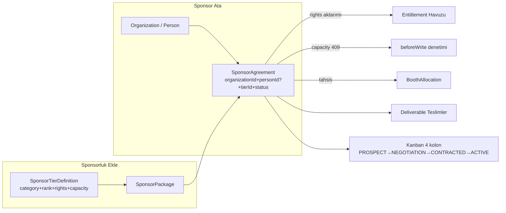

# Maven Event Management v2 — Kapsamlı Araştırma, Hata Raporu, Hedef Multi‑Tenant Yapı ve Sektörel Analiz

> **Tarih:** 2026‑09‑27 · **Dal:** `arena/01a0e491-event-management-v2` (temel: `28acc8c`)
> **Kapsam:** (1) Projeyi kapsamlı araştır + hata bul, (2) istenen multi‑tenant / yetki / sponsorluk yapısını kod referanslı biçimde tasarla, (3) sektör analizi yap.
> **Not:** Bu doküman tek başına karar kaynağıdır; uygulama adımları §5'te faz fazdır.

---

## 0. Araştırma Yöntemi ve Doğrulama Kapıları (önce hata kontrolü)

Bu ortamda aşağıdaki kapılar çalıştırıldı; sonuçlar:

| Kapı | Komut | Sonuç |
|---|---|---|
| Tip denetimi | `npx tsc --noEmit` (Prisma client üretildikten sonra) | **1 hata** — `mini-services/live-bus/index.ts:9` `socket.io` modülü bulunamadı (bkz. H‑12) |
| Lint | `npx eslint .` | **40 problem (39 error, 1 warning)** — 33 tanesi `react-hooks/set-state-in-effect`; ayrıca 2 gerçek closure-koruma hatası, 1 render‑sırasında ref erişimi, 2 react‑compiler memoization ihlali (bkz. H‑13) |
| Üretim derlemesi | `npx next build` | İlk deneme **başarısız**: `src/app/layout.tsx` Google Fonts (Geist) ağ erişimi (bkz. H‑16). Geçici lokal font yamasıyla **BUILD_EXIT:0 ✓** (yama geri alındı, çalışma ağacı temiz) |
| i18n kıyas | `node scripts/i18n-hardcoded-scan.mjs` | **21 hardcoded Türkçe string** (bkz. H‑14) |
| i18n dil paritesi | tr.json ↔ en.json düzleştirme | **3731 / 3731 anahtar birebir eşit ✓** |
| Şema üretimi | `npx prisma generate` | ✓ (ortam kısıtı: `binaries.prisma.sh` erişilemedi — engine yerine env override ile üretildi) |
| E2E testler | `npx playwright test` (repo içi **198 test bloğu**, 22 modül testi) | **Çalıştırılamadı (ortam kısıtı)**: Prisma native query engine indirilemiyor + build font ağı kapalı. Testlerin kodu okundu;bkz. H‑20 |
| Mimari gate | `.dependency-cruiser.cjs` | **Çalışmıyor**: `dependency-cruiser` paketi `package.json`'da yok (bkz. H‑17) |
| Çalışma zamanı | `PrismaClient.tenant.findFirst()` denemesi | **Başarız**: `libquery_engine-debian-openssl-3.0.x.so.node` yok → canlı smoke/E2E bu sandbox'ta mümkün değil |

**Ortam kısıtları proje hatası değildir**, ancak iki nokta proje-dayanıklılığına dair gerçektir: build'in Google Fonts'a ağ zorunluluğu (H‑16) ve `prisma generate`/runtime'ın engine indirme bağımlılığı (CI'da `PRISMA_*` env stratejisi veya engine cache'i önerilir).

Araştırma kapsamı: `prisma/schema.prisma` (103 model, satır satır), `src/lib/{store,constants,module-components}.ts`, `src/lib/api/{tenant-guard,registry,registration-chain,comms-broadcast}.ts`, `src/lib/auth/*`, `src/middleware.ts`, tüm API route'ları, 26 modül view'i (`src/components/maven/views/*`), shell/sponsorship-kanban bileşenleri, testler, worklog, docs/.

---

## 1. Mevcut Mimari Envanteri — "Ne Var, Nerede Duruyor"

### 1.1 Katmanlar ve kapsam modeli (bugün)

```
Tenant (Üst Şirket) ── 1:N ── EventSeries ── 1:N ── EventEdition (Etkinlik/Edisyon)
     │                              │
     ├─ User (personel, tek role)   ├─ EventCapability (modül anahtarları)
     ├─ Person / Organization       ├─ EventParticipation (kişi × etkinlik)
     ├─ CustomerContact (CRM havuzu)├─ Form/FormSubmission → registration-chain
     ├─ MailProviderConfig          ├─ SponsorTierDefinition/Package/Agreement
     ├─ DocumentRecord, Tenant…     ├─ CustomRole, Registration, Order, Program…
```

- **Kapsam koruması güçlü:** `src/lib/api/tenant-guard.ts` — `SCOPES` haritası (satır 30‑135) her varlık için `tenant|edition|chain|scalarChain` kipi tanımlar; `ensureInScope` (satır 403) IDOR'u 404 ile kapatır; yazıkarda `tenantId` body'den alınmaz, sunucu bağlamından yazılır (`applyWriteGuard` (satır 450)).
- **Auth zinciri:** `src/middleware.ts` (matcher yalnız `/api/:path*`, satır 112) → HMAC oturum → `x-maven-session-{tenant,role,uid}` başlıkları → `src/lib/auth/request-context.ts` `requestActor()` (satır 30) → **yalnızca** `requireStaff()`/`requireAdmin()` (satır 45/54) 403 uygular — ve bu ikisi yalnız **27 route dosyasında** çağrılıyor (bkz. H‑04).
- **Modül sistemi:** 26 modül, 7 yaşam‑döngüsü grubu — `src/lib/constants.ts` `MODULES` (satır 460‑494) + `roleCanSee` (satır 500‑507) + `src/lib/module-components.tsx` (modül→bileşen tek nokta) + `CAPABILITY_MODULE` (satır 652‑664).

### 1.2 İstenen talebin mevcut karşılığı (dürüst envanter)

| Talep | Durum | Kanıt |
|---|---|---|
| Multi‑tenant çekirdek (şirket ↔ etkinlik ayrımı) | **VAR** | `Tenant`, `EventEdition` (`schema.prisma:23,257`), tenant-guard |
| Üst şirket kimlik ayarları | **VAR** | `TenantIdentityCard` (`onsite.tsx:2547`), `Tenant` logo/tagline/about (`schema.prisma:28‑41`) |
| Üst şirket dili | **VAR (kısmi)** | `LanguageCard` (`onsite.tsx:2678`), TR/EN eşit 3731 anahtar; **ama** dil tercihi localStorage (`maven.lang`), tenant'a yazılı değil |
| Tema ayarı (şirket geneli) | **YOK** | `next-themes` yalnız `ui/sonner.tsx:3`; root layout'ta `ThemeProvider` yok; settings'te tema kartı yok |
| Kullanıcılar (personel) yönetimi | **YOK** | `User` modeli var (`schema.prisma:53`), ama liste/davet/rol‑atama UI/API **yok** (registry'de `users` anahtarı yok); register yalnız ilk kullanıcı ORG_OWNER (`auth/register/route.ts:40`) |
| Yetki alanı (rol × modül × veri girişi) | **KISMİ (UI‑özel)** | `MODULES.roles` sabit matris + `roleCanSee` — **yalnızca sidebar filtresi**; sunucuda uygulanmıyor (H‑04); `CustomRole.permissions` yazılır ama **hiç okunmaz** (H‑06) |
| Yeni etkinlikte modül görme/kullanma/veri girme izinleri | **YOK** | `User↔EventEdition` ilişkisi şemada hiç yok; personel‑etkinlik atama modeli yok |
| Şirket arşiv (önceki işler) | **KISMİ** | `ArchiveView` — yalnız `POST_EVENT|RECONCILIATION|ARCHIVED` edisyonlar (`archive.tsx:22`) + medya ZIP |
| Depo (medya/belge) | **VAR** | `MediaFolder/MediaAsset`, `DocumentRecord` (`schema.prisma:1647,1716`), Medya Arşivi modülü |
| Import/Export merkezi | **KISMİ** | 10 uç var (aşağıda §3.4) ama **şirket‑özel tek merkez UI yok**; i18n JSON import/export var (`onsite.tsx:2678` kartı) |
| Şirket kişi arşivi | **VAR** | `Person`/`Organization`/`CustomerContact` tenant‑kapsamlı (`schema.prisma:1460`) |
| Mail/SMS/WhatsApp gönderimi | **VAR (ama yanlış katmanda)** | `comms-broadcast`, `Campaign.channels`, `NotificationChannelConfig` — **ancak** İletişim modülü `COMMUNICATIONS` etkinlik yeteneğine bağlı (`constants.ts:474`) → şirket CRM'i etkinlik yeteneği kapalıysa **gizleniyor** (H‑08) |
| Organizasyon öncesi tanıtım alanı | **KISMİ** | `SocialPlan` + `Campaign.phase=PRE_EVENT` + dış portal/vitrin — hepsi **etkinlik‑bağlı**; şirket‑özel tanıtım paneli yok (H‑11) |
| Etkinlik içi kişi/kuruluş (event‑scoped) | **YOK/TERS** | `people.tsx:900` tenant‑genel liste; edisyon filtresi yok (H‑07) |
| Manuel veri girişi | **VAR** | `manual-registration.ts`, `QuickAddRow/BulkPaste`, InlineEdit (`data-tools`) |
| Form verisi → kişi bağlantısı | **VAR** | `registration-chain.ts` (FormSubmission→Person→Participation→Registration, atomik), `EventParticipation.source=PUBLIC_FORM` (`registration-chain.ts:98`) |
| **Sponsorluk Ekle / Sponsor Ata** | **YOK** | Grep: `sponsor-tiers`/`sponsor-packages` **hiçbir view'da yok**; tier CRUD UI sıfır (H‑03) |
| Tier tanımı (Altın/Platin/Bronz/Medya… düzenlenebilir) | **VERİ VAR, UI YOK** | `SponsorTierDefinition` (`schema.prisma:873`), seed (`seed/route.ts:314‑317`), registry (`registry.ts:275`) — arayüz yok; kanban dialogu **hard‑code** PLATINUM/GOLD/SILVER/BRONZE (`sponsorship-kanban.tsx:299‑306`) |
| Tier kapasite (ör. "Bronz 3 adet") | **VERİ VAR, DENETİM YOK** | `capacity` alanı var (`schema.prisma:876`) — hiçbir `validate/beforeWrite` kontrolü yok |
| Birden fazla firma/tier | **VERİ SEVİYESİNDE VAR** | `SponsorAgreement.tierId` çok‑tanımlı; UI'da tier'a atama akışı yok |

---

## 2. KAPSAMLI HATA RAPORU

Önem: **P0** = iş akışı kırık/güvenlik · **P1** = taleple doğrudan çelişen eksik · **P2** = kalite/tech‑debt.

### — P0 —

#### H‑01 · Sponsorluk "Yeni Anlaşma" akışı uçtan uca KIRIK (her zaman 400)
- **Kanıt:**
  - `src/components/maven/views/sponsorship.tsx:178‑191` — `handleNewDeal` POST gövdesi: `{ editionId, amount, currency, status }`. **`organizationId` YOK**, `tierId` YOK, `packageId` YOK.
  - `src/components/maven/sponsorship/sponsorship-kanban.tsx:84‑96` — diyalog yalnız serbest metin `newOrg` + `tierName` alır; `tierName` payload'da yok sayılır.
  - `prisma/schema.prisma:906` — `SponsorAgreement.organizationId String` (**zorunlu**).
  - `src/lib/api/registry.ts:286‑298` — `sponsor-agreements` için `validate` **tanımlı değil**.
  - `src/app/api/[entity]/route.ts:171‑175` — Prisma "Argument organizationId is missing" → catch (`route.ts:171`) → `400 "Kayıt oluşturulamadı`.
- **Etki:** Kanban'daki "Yeni Sponsor Anlaşması" butonu **hiçbir koşulda kayıt oluşturmaz**; kullanıcı "Kayıt Başarısız" görür. `orgName` (yeni firma adı) hiçbir zaman `Organization`'a yazılmaz — CRM'e de sızmaz.
- **Düzeltme yolu:**
  1. `handleNewDeal` imzasını genişlet: `{ orgId, orgName, amount, stage, tierId, personId? }`; UI'da firma seçimini `Select` (mevcut `organizations` listesi, `listEntity("organizations")`) + "Yeni firmayı da oluştur" seçeneği yap.
  2. Firma yoksa önce `POST /api/organizations` (`registry.ts:47` tenant‑scoped — çalışır), sonra agreement.
  3. `registry["sponsor-agreements"].validate` ekle: `organizationId` zorunlu, `status` enum kontrolü, `tierId` verilmişse `editionId` uyumu (bkz. H‑02).

#### H‑02 · Kanban durum sözlüğü şema ile ÇELİŞİYOR (geçersiz veri yazılıyor)
- **Kanıt:**
  - Kanban aşamaları: `sponsorship-kanban.tsx:40‑45` → `LEAD|PROPOSAL|CONTRACT|PAID`.
  - Şema: `schema.prisma:911` → `PROSPECT|NEGOTIATION|CONTRACTED|ACTIVE|COMPLETED|CANCELLED`.
  - `sponsorship.tsx:168‑176` — `handleMoveKanbanStage` doğrudan `PUT { status: "PROPOSAL"|"CONTRACT"|"PAID" }` yazar; `validate` olmadığı için **geçersiz durumlar DB'ye girer**.
  - Sözleşme kartı rozeti beklenen sözlüğü kullanır: `sponsorship.tsx:319` (`PROSPECT/NEGOTIATION/…`).
  - Portal sponsor listesi ve testleri `ACTIVE|CONTRACTED` bekler: `tests/modules/06-sponsors.spec.ts:19`.
- **Etki:** İlerletilen kartların rozetleri bozuk görünür; kanban PAID aşamasına giden anlaşma portalde/testte **görünmez**; raporlar (`status` filtreli dashboard) yanıltır; temizlik imkânsızleşir (hangi sözlük gerçek?).
- **Düzeltme yolu (öneri — tek sözlük):**
  - Kanban'ı şemaya hizala: `LEAD→PROSPECT`, `PROPOSAL→NEGOTIATION`, `CONTRACT→CONTRACTED`, `PAID→ACTIVE` (tahsilat `COMPLETED` ayrı buton). `STAGES[].key` alanını bu enum'a çevir (`sponsorship-kanban.tsx:40`), `stageMap` normalizasyonunu (`:58‑78`) sil.
  - Alternatif (daha geniş değişiklik): şemaya `pipelineStage String?` alanı ekle, `status`'u finansal yaşam döngüsünde bırak — ama o zaman her okuyucu (portal, test, dashboard) iki alanı bilmek zorunda kalır; **önerim tek sözlük**.
  - `registry["sponsor-agreements"].validate` içinde enum kapısı: bilinmeyen status → 400.

#### H‑03 · Tier altyapısı fiilen ÖLÜ + kanban hard‑code (tasarım iddiasıyla çelişiyor)
- **Kanıt:**
  - `grep -rn "sponsor-tiers|sponsor-packages" src/` → **0 sonuç** (view katmanında hiç kullanılmıyor).
  - Kanban diyalogunun tier seçici: `sponsorship-kanban.tsx:299‑306` → sabit `PLATINUM/GOLD/SILVER/BRONZE`.
  - `sponsorship.tsx:196` PageHeader: *"Tier hard-code değildir — her etkinlik kendi tier'ını tanımlar"* — **iddia kodla çelişiyor**.
  - `SponsorTierDefinition.capacity` (`schema.prisma:878`) hiçbir yerde denetlenmiyor (flows/registry'de sponsor‑tier kontrolü yok).
  - Seed 4 tier tanımı yapıyor (`seed/route.ts:314‑317`: Gold 5, Silver 10, Bronz 15, Medya 2 kapasiteli) — ama UI bunları göstermiyor; kanban'daki "Sponsorluk Seviyesi" seçimi DB'ye hiç gitmiyor.
  - Varsayılan `newTier` değeri `"GOLD"` (`:57`) — şemadaki gerçek kayıt `name: "Gold Sponsor"` ile eşleşmiyor.
- **Etki:** "Bronz Sponsorluk 3 adet" gibi kapasite kuralları, tier'a göre fiyat/hak ilişkisi, tier‑bazlı raporlama **tamamen çalışmıyor**; her etkinlik kendi tier'ını tanımlayamıyor (üstelik tanımlasa bile görünmüyor).
- **Düzeltme yolu:** §3.7 "Sponsorluk Ekle" tasarımı — tier CRUD UI + kapasite `beforeWrite` denetimi + kanban'ın tier seçicisini `listEntity("sponsor-tiers", { editionId })` beslemesi.

#### H‑04 · Yetkilendirme yalnızca İSTEMCİ tarafında (sunucuda modül/rol kilidi yok)
- **Kanıt:**
  - `src/lib/constants.ts:500‑507` — `roleCanSee` yalnızca menü/rol filtresi (`shell.tsx:53` çağırır, tanım `:103`).
  - `src/app/api/[entity]/route.ts` (GET satır 36, POST satır 124) ve `[entity]/[id]/route.ts` (GET 47, PUT 66, DELETE 127) — **`requireStaff()`/`requireAdmin()` çağrılmıyor**; `requestActor()` yalnız audit aktörü için (`[entity]/route.ts:200`, `[id]/route.ts:29`).
  - `request-context.ts:41‑58` — `requireStaff/requireAdmin` tanımlı ama yalnız **27 route dosyasında** (campaigns, import/export, scan, kvkk…). Genel CRUD (`/api/sponsor-agreements`, `/api/incomes`, `/api/editions`…) bunların dışında.
  - `tenant-guard.resolveContext` yalnız **kiracı**yı doğrular, rolü **okumaz**.
  - `worklog.md` (son Stage Summary) bunu açıkça kabul ediyor: *"rol filtresi yalnız istemci… API tarafı kalıcı requireStaff/requireAdmin koruması… derinlemesine rol‑bazlı API guard'ı gelecek tur için not"*.
- **Etki (auth-on/üretim):** `MAVEN_AUTH=on` iken geçerli her personel oturumu (ör. ONSITE_MANAGER) `DELETE /api/sponsor-agreements/…`, `PUT /api/tenants/…`, tüm finans uçlarını **çağırabilir**. `MODULES.roles` matrisi sahte güvenlik hissi verir. Bu, istediğiniz "kim hangi modülü kullanabilir / veri girişi izni" isteğinin de temel engeli.
- **Düzeltme yolu:** §3.2 — `requireModule(moduleId, access)` guard'ı + registry'ye `module` alanı + generic route'lara entegrasyon; UI ile **aynı** matristen besleme (tek doğruluk kaynağı).

### — P1 —

#### H‑05 · Personel kullanıcı yönetimi yüzeyi yok
- `User` (`schema.prisma:53`) var; ama: registry'de `users` yok, `SCOPES`'ta yok, hiçbir view'da kullanıcı listesi/rol atama/silme/davet yok. `auth/register` yalnız ilk kullanıcıyı ORG_OWNER, diğerini ORG_ADMIN yapar (`auth/register/route.ts:40`) — yani **9 rollerden hiçbiri UI'dan verilemiyor** (elle DB'ye gerek var).
- **Düzeltme:** §3.2.1 — `users` registry girişi (`validate`: email unique, rol `STAFF_ROLES` içinden, self‑delete yasak) + `requireAdmin` + Ayarlar→Kullanıcılar kartı.

#### H‑06 · `CustomRole.permissions` dekoratif; personel‑etkinlik ataması yok
- `CustomRole.permissions` yalnızca seed tarafından yazılır (`seed/route.ts:1026‑1028`); sistemde **hiçbir okuyucu yok** (grep: yalnız schema+registry).
- `EventRoleAssignment` (`schema.prisma:507`) **katılımcı** rolleri içindir (ATTENDEE/SPEAKER…), personel yetkisi değildir.
- Üç paralel rol modeli: `EventRoleAssignment` + `CustomRole` + `EventPersonRole` (`schema.prisma:2359` — yalnız `registry.ts:735`, UI yok) → **model dağınıklığı**.
- `User` ile `EventEdition` arasında bağ yok → "bu personel bu etkinlikte" tanımı imkânsız.
- **Düzeltme:** §3.2 — personel rolleri (`StaffRole`) ile katılımcı rolleri (CustomRole/EventRoleAssignment) net ayrıştırılır; `EventPersonRole` ya entegre edilir ya kaldırılır (bkz. H‑17 notu).

#### H‑07 · Kişi/Kuruluş modülü etkinliğe bağlı DEĞİL (tersine katman)
- `people.tsx:900` — `listEntityPaged("people", { q })` **tenant‑genel**; seçili edisyon filtresi yok; `SCOPES.people = { mode: "tenant" }` (`tenant-guard.ts:32`).
- `people.tsx:2034` — kurumlar da tenant‑genel.
- Kişinin etkinlikle bağlantısı yalnız 360‑detayda (`Person360.participations`, `people.tsx:36‑48`) görünür; ana liste her zaman tüm şirket arşividir.
- **İstenen davranış:** modül, o an seçili edisyonun **kişilerini** (=`EventParticipation` üzerinden) göstersin; şirket arşivi ayrı bir sekmede kalsın.
- **Düzeltme:** §3.6 — `GET /api/people?editionId=` desteği (`registry.people.filterFields` yerine özel relationWhere: `participations: { some: { editionId } }`) + UI'da "Bu Etkinlik | Şirket Arşivi" sekmeleri.

#### H‑08 · Şirket CRM/İletişim, etkinlik yeteneğine mahkûm (yanlış katman)
- `constants.ts:474` — `communications` modülü `capability: "COMMUNICATIONS"`; `shell.tsx:53/103` `visibleFor` bu yeteneği kapalıysa menüyü **gizler**.
- Oysa `CustomerContact` tenant‑kapsamlı (`schema.prisma:1460`) ve `import-participants` ("üst firma, kendi organizasyonlarındaki katılımcılardan müşteri datası üretmeli" — route başlığı) **şirket işi**dir.
- Sonuç: COMMUNICATIONS yeteneği kapalı bir etkinlikte şirket‑genel mail/SMS/WhatsApp havuzu **erişilemez**.
- **Düzeltme:** §3.5 — iletişimini ikiye böl: (a) **Şirket İletişim** (capability yok, tenant‑kapsam), (b) **Etkinlik Kampanyaları** (mevcut `Campaign`, capability'li). `MODULES`'a `company-communications` gibi yeni id ekle (`module-components.tsx` + i18n — üçlü kayıpsızlık kuralı zaten mevcut).

#### H‑09 · Tema/aydınlık‑karanlık ayarı yok
- `next-themes` kurulu ama yalnız `ui/sonner.tsx:3` kullanıyor; `layout.tsx`'te `ThemeProvider` **yok**; `suppressHydrationWarning` var ama `class` yönetimi yok.
- Settings'te dil kartı var (`onsite.tsx:2205, 2678`), tema kartı **yok**; `Tenant` modelinde tema/branding alanı yok (`schema.prisma:23‑46`).
- **Düzeltme:** §3.3 — root'a `ThemeProvider attribute="class"` + `ThemeCard` (Açık/Koyu/Sistem) + `Tenant.theme String @default("system")` (additive) + shell'de okuma.

#### H‑10 · Şirket‑özel Arşiv/Depo/İçe‑Dışa Aktarım merkezi yok
- Mevcut uçlar modül‑bazlı dağınık:

| Uç | Kapsam |
|---|---|
| `GET /api/media/export` | etkinlik medya ZIP |
| `GET/POST /api/registrations/{export,import}` | etkinlik kayıt |
| `GET/POST /api/reservations/{export,import}` | etkinlik oda |
| `GET /api/accounting/export` | muhasebe |
| `GET/POST /api/customer-contacts/{export,import}` + `import-participants` | şirket CRM (en geniş olan) |
| `GET /api/form-submissions/export` | form verisi |
| `POST /api/program/import` | program |
| i18n JSON export/import (`onsite.tsx:2684‑2707`) | arayüz dili |
| `scripts/ops-gates.sh` (VACUUM INTO + AES‑256 yedek) | **CLIOnly — UI'dan tetiklenemiyor** |

- `ArchiveView` yalnız biten etkinlikleri listeler (`archive.tsx:22`); "şirket deposu" (tüm işlerin toplu export'u, geri yükleme, şablon import) **yok**.
- **Düzeltme:** §3.4.

#### H‑11 · Tanıtım alanı yalnız etkinlik‑bağlı
- `Campaign.editionId` zorunlu (`schema.prisma:1419`), `SocialPlan.editionId` zorunlu (`schema.prisma:1942`); şirket‑özel duyuru/kampanya modeli yok. Şirket vitrini yalnız `Tenant` kimlik alanlarıyla sınırlı (logo/tagline/about — `schema.prisma:35‑46`, public uçlar `PUBLIC_RULES` `middleware.ts:36‑47`).
- **Düzeltme:** §3.5 "Tanıtım" — şirket‑kampanya (`editionId?` nullable'a çekilebilir **veya** ayrı `TenantCampaign`), kurumsal medya havuzu, ön‑etkinlik landing içerikleri (`PortalBlock` edisyon‑kapsamlı kalabilir).

### — P2 —

#### H‑12 · `tsc` tek hata: mini‑service bağımlılığı
- `mini-services/live-bus/index.ts:9` → `socket.io` root `package.json`'da yok (yalnız `socket.io-client`); mini‑service'in kendi `package.json`/`bun.lock` var ama kök `tsc` kapsamına giriyor.
- **Düzeltme:** `tsconfig.json` `exclude: ["mini-services"]` **veya** `socket.io`'yu root devDependencies'e ekle (bun workspaces ile önerilir).

#### H‑13 · ESLint 39 hata — çoğunluk React 19 kalıbı, 3'ü gerçek risk
- 33 × `react-hooks/set-state-in-effect` (ör. `people.tsx:155,1097`, `form-center.tsx:289,311,316`, `floors.tsx:65,78`, `portal-app.tsx:620,1725`…): `useEffect` içinde senkron `setState` — performans/kalıp ihlali.
- **Gerçek closure riskleri:**
  - `onsite/kiosk-terminal.tsx:107` — `resetToScanning` **ilanından önce** effect içinden kullanılıyor (lint: "accessed before it is declared"); güncel sürümü yakalamayabilir.
  - `portal/qr-scanner.tsx:50` — `tick` kendi kendini `useCallback` içinde引用 (aynı sınıf).
  - `form-center.tsx:2269` — **render sırasında ref okuma** (`insertAtRef.current`, tanım `:227`): render yan etkisiz olmalı; `:509‑512,818` yazım deseni revize edilmeli.
  - `form-center.tsx:762,770` — react‑compiler "Existing memoization could not be preserved".
- **Düzeltme:** `useEffect` gövdelerini asenkron callback'lere taşı; kiosk/qr'dda `useRef` + effect içinden okuma; form‑center'da sıra değerini state'e taşı.

#### H‑14 · 21 hardcoded string (i18n kapısı kırmızı)
- `node scripts/i18n-hardcoded-scan.mjs` → 21 ihlal; örnekler: `sponsorship-kanban.tsx:327 "Anlaşmayı Kaydet"`, `accounting.tsx:686,708,1551,1577,1580`, `people.tsx:942,1008,1405,1409`, `session-cme-console.tsx:134,164,192`, `peer-review-modal.tsx:218`, `timetable-grid.tsx:417`.
- **Düzeltme:** `t()` anahtarlarına taşı + `i18n:scan` CI kapısı.

#### H‑15 · Mimari doküman ŞEMAYLA ÇELİŞİYOR (drift)
- `docs/Maven_Event_Management_Ortak_Organizasyonel_Mimari.md`: "20 model", `Department/Role/Member/Team`, "Tüm parasal değerler `Float`" (§6.5), `SponsorTier: PLATINUM… sabit` (§3.1) — oysa gerçek: **103 model**, Department/Member/Team **yok**, para `Int` kuruş (F6, `constants.ts:517` `fmtMoney`), tier'lar hard‑code değil (`schema.prisma:871‑887`).
- Doküman "tek doğruluk kaynağı" iddiasında (başlık) — bu iddia artık **yanlış**.
- **Düzeltme:** dokümanı şemadan türet (veya `scripts/impact-analysis.ts` gibi otomatik üret); §3.1 tablosunu kaldır/güncelle.

#### H‑16 · Build kırılganlığı + Next 16 uyarıları
- `layout.tsx:2` `next/font/google` → build zamanında ağ zorunlu; offline/CI'da `Failed to fetch Geist` ile build biter (bu ortamda **yaşandı**). Yerel fallback + `next/font` fallback stratejisi ekle.
- `middleware.ts:1` → Next 16'da depremde: *"The 'middleware' file convention is deprecated. Please use 'proxy' instead."* (build log) — `npx @next/codemod@canary middleware-to-proxy` planlanmalı (dikkat: `MAVEN_AUTH` env inlining davranışı korunmalı).
- `src/app/api/admin/db-migration/route.ts:42` `fs.statSync(ds.path)` → Turbopack tüm projeyi trace ediyor (build uyarısı): `turbopackIgnore` veya statik alt‑klasör.

#### H‑17 · Mimari gate (dependency‑cruiser) çalışmıyor
- `.dependency-cruiser.cjs` mevcut ama `dependency-cruiser` `package.json`'da yok → `npx depcruise` placeholder paket hatası verir. README'deki mimari kapı iddiası uygulanamaz durumda.
- **Düzeltme:** `devDependencies`'e ekle + `npm run lint:arch` script'i + CI.

#### H‑18 · Kanban içinde demo‑hardcode B2B matrisi
- `sponsorship-kanban.tsx:196‑230` — sabit "Novartis ↔ Prof. Kaya", "Pfizer ↔ Doç. Demir" satırları (gerçek veri değil). Gerçek B2B modülü ayrı (`views/b2b.tsx` + `B2bPlan`). Yanıltıcı: kullanıcı gerçek sandığı gibi algılayabilir.
- **Düzeltme:** ya `b2b` modülüne bağlantı ver (buton → `setModule("b2b")`), ya da matrisi gerçek `b2b-assignments` verisinden üret.

#### H‑19 · Stand tahsisi yanlış anlaşmayı seçebilir
- `sponsorship.tsx:484‑489` `boothsAllocTargetOrg`: tahsis hedefi yoksa **ilk** `CONTRACTED|ACTIVE` anlaşmayı alır — çoklu sponsorda yanlış firmaya stand bağlanabilir.
- **Düzeltme:** diyalogda anlaşma/kurum seçimi zorunlu; tahsis öncesi `agreementId` parametresiyle kullanıcı onayı.

#### H‑20 · Testler bu koşuda koşturulamadı (kapsam notu)
- 198 test bloğu mevcut; ortam kısıtı (engine/font ağı) nedeniyle Playwright koşulmadı. Ayrıca **hiçbir test admin kanban "Yeni Anlaşma" akışını kapsamıyor** (06‑sponsors portal‑düzeyi) — H‑01'in testten kaçması normal. §5.3'te kapatma testleri var.

---

## 3. HEDEF YAPı — İstenen Multi‑Tenant / Yetki / Sponsorluk Mimarisi

### 3.1 Kapsam modeli (Üst Şirket ↔ Etkinlik)

```
┌────────────────────────────────────────────────────────────────────┐
│ PLATFORM (ops — bu sürümde yok, ileride SaaS)                      │
├────────────────────────────────────────────────────────────────────┤
│ ŞİRKET / ÜST ORGANİZASYON (Tenant)  ← "üst şirket alanı"           │
│  • Kimlik, logo, slogan, iletişim (VAR: schema 35‑46)               │
│  • Dil (VAR, tenant'a taşınacak) + TEMA (YOK → H‑09)               │
│  • Kullanıcılar & Yetkiler (YOK → H‑05/H‑04)                       │
│  • Şirket Kişi/Kurum Arşivi + CRM + Mail/SMS/WhatsApp (VAR,       │
│    capability'den bağımsızlaştırılacak → H‑08)                     │
│  • Arşiv & Depo + İçe/Dışa Aktarım Merkezi (KISMİ → H‑10)          │
│  • Tanıtım (YOK → H‑11)                                            │
│  • Entegrasyonlar, KVKK belgeleri, abonelik (VAR: models)          │
├────────────────────────────────────────────────────────────────────┤
│ ETKİNLİK (EventEdition)  ← mevcut 26 modül                         │
│  • Yetenekler (EventCapability), program, kayıt, sponsorluk…        │
│  • Etkinlik KİŞİ & KURULUŞ = EventParticipation (kişi × etkinlik)   │
│  • Etkinlik kampanyaları, formlar, portal                           │
└────────────────────────────────────────────────────────────────────┘
Veri sahipliği tablosu:
  Tenant       : User, Person, Organization, CustomerContact, MailProvider,
                 DocumentRecord, TenantSubscription, MediaFolder(şirket), ActivityLog
  Edition      : Form, Campaign, SponsorTier/Package/Agreement, Registration,
                 Program, Hotel, Booth, CustomRole, SocialPlan, PortalBlock…
  Köprü        : EventParticipation (Person × Edition), EventOrganizationAssignment,
                 EventOrganizationAssignment, UserEventAssignment (YENİ)
```

### 3.2 Yetki Mimarisi — "Rol/Yetki Alanı" (etkinlikten bağımsız + etkinlik override'lı)

#### 3.2.1 Yeni modeller (additive — mevcut tablolar bozulmaz)

```prisma
// Şirket‑özel personel rolü (system rollerine EK; §48 9 rol korunur)
model StaffRole {
  id          String  @id @default(cuid())
  tenantId    String
  key         String  // "FIELD_COORDINATOR"
  name        String  // "Saha Koordinatörü"
  description String?
  isSystem    Boolean @default(false) // ORG_OWNER vb. silinemez
  isActive    Boolean @default(true)
  createdAt   DateTime @default(now())
  tenant      Tenant  @relation(fields: [tenantId], references: [id], onDelete: Cascade)
  @@unique([tenantId, key])
}

// Rol × Modül × Eylem — tek doğruluk kaynağı (UI ve API AYNI tabloyu okur)
// scope: tenant (editionId=null → şirket geneli) VEYA edition (etkinlik override)
model ModulePermission {
  id        String  @id @default(cuid())
  tenantId  String
  editionId String? // null = şirket geneli varsayılan
  moduleId  String  // MODULES.id ile birebir: "sponsorship", "people"…
  roleKey   String  // StaffRole.key | §48 rolü
  access    String  @default("NONE") // NONE | VIEW | USE | EDIT | EXPORT
  updatedAt DateTime @updatedAt
  tenant    Tenant      @relation(fields: [tenantId], references: [id], onDelete: Cascade)
  edition   EventEdition? @relation(fields: [editionId], references: [id], onDelete: Cascade)
  @@unique([tenantId, editionId, moduleId, roleKey])  // SQLite: null unique dikkat — uygulamada upsert管理
}

// Personelin etkinliğe atanması (kim bu etkinlikte hangi rolde)
model UserEventAssignment {
  id        String   @id @default(cuid())
  userId    String
  editionId String
  roleKey   String? // boş = şirket rolüyle devam
  status    String   @default("ACTIVE") // ACTIVE|REMOVED
  notes     String?
  createdAt DateTime @default(now())
  user      User       @relation(fields: [userId], references: [id], onDelete: Cascade)
  edition   EventEdition @relation(fields: [editionId], references: [id], onDelete: Cascade)
  @@unique([userId, editionId])
}
```

#### 3.2.2 Öncelik zinciri (çözüm algoritması)

```
resolveAccess(user, moduleId, editionId, action):
  1. role = user.role                        # §48 sistem rolü
  2. ORG_OWNER|ORG_ADMIN → FULL              # (mevcut roleCanSee davranışı korunur)
  3. var mı UserEventAssignment(user, editionId) ve roleKey?  → evetse onun ModulePermission'ı
  4. yoksa StaffRole/rol'ün tenant-scope ModulePermission'ı (editionId=null)
  5. yoksa FALLBACK: MODULES.roles sabit matrisi (geriye-uyum, testler bozulmaz)
  action mapesi: VIEW→menü+GET · USE→butonlar+POST · EDIT→PUT/inline · EXPORT→export uçları
```

#### 3.2.3 Sunucu uygulaması (H‑04'ün kapatılması)

1. `src/lib/auth/request-context.ts`'e ekle:
   ```ts
   export async function requireModule(moduleId: string, access: "VIEW"|"USE"|"EDIT"|"EXPORT")
     : Promise<Response | null>   // auth-off → null (demo davranışı korunur)
   ```
2. `src/lib/api/registry.ts` — her entity config'e `module?: string` alanı (`sponsor-agreements → "sponsorship"`, `incomes → "accounting"`…).
3. `src/app/api/[entity]/route.ts` + `[id]/route.ts` — GET öncesi `requireModule(config.module, "VIEW")`, POST `USE`, PUT `EDIT`, DELETE `EDIT|EXPORT` kararı; **403** döner.
4. Ek uçlar (`/api/flows`, `/api/media/export`, …) aksiyon başına `requireModule`.
5. `SCOPES`'a dokunma — kapsam (kiracı) ile yetki (rol) ayrık kalır: `ensureInScope` = kimlik, `requireModule` = yetki.

#### 3.2.4 UI — Ayarlar → "Kullanıcılar & Yetkiler" sekmesi (H‑05, H‑06, istek maddesi 1)

Yeni bileşen `src/components/maven/views/user-admin.tsx` (+ `module-components.tsx`'e `settings` alt‑sekmesi, i18n `settingsView.tabUsers/tabPermissions`):

| Kart | İçerik |
|---|---|
| Kullanıcılar | tablo (ad, e‑posta, sistem rolü, son giriş, durum) · Davet Ekle (mail) · Rol değiştir · Kilitle/Sil (ORG_OWNER onayı) |
| Personel Rolleri | §48 + `StaffRole` CRUD (ad, anahtar, açıklama) |
| Yetki Matrisi | **modül × rol** ızgara; hücre = `NONE/VIEW/USE/EDIT/EXPORT` (dropdown); "Şirket varsayılanı" ve "Bu etkinlik override'ı" iki katman toggle |
| Etkinlik Atamaları | seçili edisyonda çalışan personel listesi (`UserEventAssignment`) · kişi ekle · rol override |

Tümü `ModulePermission`/`users` uçlarına yazar; `roleCanSee` gibi saf fonksiyon `effectiveAccess()` client‑side menüde, server‑side guard'da **aynı** veriyi okur.

### 3.3 Üst Şirket Ayarları sayfası (ana ayarlar · dil · tema · kullanıcılar)

Mevcut `SettingsView` (`onsite.tsx:2161‑2230`) zaten "GRUP 1 · ÜST FİRMA / GRUP 2 · BU ETKİNLİK" ayrımı yapıyor — bu yapı **korunur ve genişletilir**:

```
Ayarlar (üstkİ grup)
 ├─ Firma Kimliği        TenantIdentityCard        (VAR: onsite.tsx:2547)
 ├─ Dil                  LanguageCard              (VAR: 2678)  → tercih tenant'a yazılacak (Tenant.defaultLang)
 ├─ Tema                 ThemeCard                 (YENİ: H‑09) → ThemeProvider + Tenant.theme
 ├─ Kullanıcılar & Yetkiler  UserAdminPanel        (YENİ: §3.2.4)
 ├─ Arşiv & Depo         CompanyArchiveCard        (YENİ: §3.4)
 ├─ İçe/Dışa Aktarım     ImportExportHub           (YENİ: §3.4)
 ├─ İletişim (şirket)    CompanyCommsCard          (TAŞI: H‑08)
 ├─ Tanıtım              PromotionCard             (YENİ: H‑11)
 ├─ Entegrations         mevcut integrations view  (VAR)
 └─ KVKK/Abonelik        ComplianceView'den taşıma (VAR: models)
```

Ek `Tenant` alanları (additive): `theme String @default("system")`, `defaultLang String @default("tr")`, `accentColor String?`.

### 3.4 Şirket Arşiv & Depo + İçe/Dışa Aktarım Merkezi (H‑10)

Yeni sekme/sayfa **"Arşiv & Depo"** (`views/archive.tsx` genişletilir veya `views/data-vault.tsx`):

1. **İşler Arşivi** (mevcut): `POST_EVENT|RECONCILIATION|ARCHIVED` edisyonlar + medya ZIP + katılımcı bloğu.
2. **Şirket Deposu (YENİ):**
   - Toplu export: tek JSON snapshot (`/api/export/company-snapshot` — şema listesi + satırlar, tenant‑guard'lı), CSV'ler (kişi, kurum, sponsorluk, kampanya).
   - Şablon import: kişi/kurum/tier CSV‑XLSX (mevcut `xlsx` + `fastest-levenshtein` altyapısı `data-tools/BulkPasteDialog` ile uyumlu).
   - Yedek: `scripts/ops-gates.sh` VACUUM INTO + integrity_check akışını `/api/admin/backup` (requireAdmin) ile UI'a bağla.
3. **İçe Aktarım geçmişi**: hangi dosya, kim, kaç satır, hata raporu (`IntegrationLog` benzeri yeni `ImportJob` veya `ActivityLog` tipi).

### 3.5 Şirket Kişi Arşivi + Mail/SMS/WhatsApp + Tanıtım (H‑08, H‑11)

**Mevcut iyi temel:** `CustomerContact` (tenant, `commsOptIn`, `lastEmailAt/Sms/WhatsApp`), `comms-broadcast.tsx`, `ChannelsChecklist` (EMAIL/SMS/WHATSAPP), `customer-contacts/import-participants`, tekil gönderim `sendTarget`, `MailProviderConfig` (tenant), `NotificationChannelConfig` (edition).

Yapılacaklar:
1. **Modül ayrımı:** `MODULES`'a `company-communications` (grup `crm`, `capability: null`) ekle; mevcut `communications` (etkinlik kampanyaları) `capability: "COMMUNICATIONS"` ile kalsın. Bu, "şirketin kendi listelerinden gönderimi etkinlikten bağımsız" kılar (kayipsızlık üçlüsü: constants + module-components + i18n).
2. **Segment ortaklığı:** şirket segmenti (`CustomerContact.tags`) ile etkinlik segmenti (`Campaign.audienceJson`) aynı `comms-broadcast` motorunu kullanır; "etkinlikten kişi aktar" butonu mevcut `import-participants` (zaten `requireStaff`, KPI'lı).
3. **Tanıtım paneli (YENİ):**
   - **Kurumsal kimlik vitrini** (mevcut public uçlar `PUBLIC_RULES`): logo/slogan/hakkında düzenleme + önizleme.
   - **Ön‑etkinlik duyuru planı:** `SocialPlanAnnouncement` benzeri, ama editionId'siz `TenantAnnouncement` (ek model) + çok kanallı gönderim (mevcut broadcast).
   - **Kurumsal medya havuzu:** `MediaFolder` sistem klasörleri zaten var (`media.tsx`); şirket‑kapsam klasör (`editionId=null` medya) ekle.
   - Mevcut `SocialPlan` + `Campaign.phase=PRE_EVENT` etkinlik‑içi tanıtım olarak kalır (ayrım: şirket tanıtımı ↔ etkinlik tanıtımı).

### 3.6 Etkinlik İçi Kişi & Kuruluş (event‑scoped) + form bağlantısı (H‑07)

**İstenen:** "Programdaki kişi/kuruluş kısmı, o sırada bağlı olduğun organizasyonun kişileri olmalı; veri girişi manuel **ve** form sisteminden de alabilmeli."

**Tasarım:**

```
Kişiler modülü (people.tsx) — üstte kapsam sekmeleri:
┌──────────────────────┬──────────────────────┐
│ [Bu Etkinlik]        │ [Şirket Arşivi]      │
│ EventParticipation   │ Person (tenant)      │
│ bazlı liste          │ — mevcut davranış    │
└──────────────────────┴──────────────────────┘
```

1. **API:** `registry.people`'ye özel `relationFilter` desteği: `?editionId=X` → `where: { participations: { some: { editionId: X } } }` (registry'de `filterFields` eşitlik yeterli değil — `GET /api/people` route'una `editionId` okuyucu ekle; `tenant-guard`'a **dokunma**, kapsam yine tenant).
   - Aynı desen `organizations` için: `?editionId=X` → `eventAssignments: { some: { editionId } }` **ve** o etkinlikte agreement'ı/kaydı olan kişilerin şirketleri.
2. **Liste kolonları (Bu Etkinlik sekmesi):** katılım kaynağı (`EventParticipation.source` — `PUBLIC_FORM|IMPORT|ADMIN_ENTRY|ONSITE_WALK_IN…`), katılım durumu, rol rozetleri (`EventRoleAssignment`), form bağlantısı rozeti ("Kayıt Formu #7").
3. **Veri giriş yolları (hepsi zaten var, tek ekranda köprülenecek):**

| Yol | Uç/dosya | Kanıt |
|---|---|---|
| Manuel tekil | `POST /api/flows` + `manual-registration.ts` `createManualRegistration` | `manual-registration.ts:80` |
| Hızlı satır/toplu yapıştır | `QuickAddRow`, `BulkPasteDialog` (`data-tools`) | `people.tsx:1409` |
| Form (public) | `public-forms → FormSubmission → registration-chain` (atomik, idempotent) | `registration-chain.ts:1‑15`, `source: PUBLIC_FORM` `:98` |
| Import CSV/XLSX | `POST /api/registrations/import` | kayıt+WAITLIST akışı |
| Davet | `Invitation` → dönüşüm | `schema.prisma:524` |
| Saha | `scan` + walk‑in | `REG_SOURCES` `constants.ts:383` |
4. **Form→kişi izlenebilirliği:** `FormSubmission.registrationId` + `EventParticipation.source` + `ActivityLog` zaten bağlı; kişi 360'ına "Veri kaynağı" satırı ekle (`people.tsx` Person360: `participations[].source` göster — alan `:37`'de var, UI'da rozetlenmeli).

### 3.7 SPONSORLUK YENİDEN TASARIMI — "Sponsorluk Ekle" ve "Sponsor Ata" (H‑01/02/03, istek maddesi 6)

#### 3.7.1 Yeni UI bilgisi (sekme/bölüm yapısı)

```
Sponsor & Fuar (sponsorship.tsx)
├─ Sekme 1 · GENEL BAKIŞ     : KPI (anlaşma sayısı, tahsilat, doluluk) + Kanban (H‑02 düzeltilmiş)
├─ Sekme 2 · SPONSORLUK EKLE : Tier & Paket tanımları           ← YENİ
├─ Sekme 3 · SPONSOR ATA     : Kurum/Kişi → Tier'a atama        ← YENİ
├─ Sekme 4 · SÖZLEŞMELER     : mevcut anlaşma kartları + teslimler
├─ Sekme 5 · HAK HAVUZLARI   : mevcut Entitlement akışı (20/14/2/4)
└─ Sekme 6 · FUAR & TAHSİS   : mevcut stant matrisi (H‑19 düzeltmeli)
```

#### 3.7.2 Sponsorluk Ekle — Tier modeli genişletmesi

`SponsorTierDefinition` (`schema.prisma:873‑887`, capacity `:878`) **additive** genişletme:

```prisma
model SponsorTierDefinition {
  // mevcut: name, displayOrder, capacity, price, currency, brandingRules
  category      String   @default("TIER")  // HEADLINE|TIER|ACTIVITY|CONTENT|BRANDING (UX §49)
  rank          Int      @default(50)       // hiyerarşi: 1=en üst (Naming→Headline→Tier→…)
  rights        String?  // JSON: [{type:"COMPLIMENTARY_REGISTRATION",qty:5,label:"5 Ücretsiz Kayıt"}, …]
  color         String?  // rozet rengi (UI)
  badgeIcon     String?
  isActive      Boolean  @default(true)
  isDefaultPreset Boolean @default(false)  // ön yüklemeden geldi mi
  notes         String?
}
```

- **Ön yükleme (şablon):** "Hazır Tier'ları Yükle" butonu → `POST /api/flows {action:"sponsor.tiers.seed"}` → `Naming, Altın/Gold, Platin/Platinum, Bronz/Bronze, Medya/Media, Öğrenci…` — **hepsi sonradan isim/hak/fiyat/kapasite olarak düzenlenebilir**; sistem adı dayatması yok (`isSystem` alanı YOK — bilinçli).
- **Hak ilişkisi:** `rights` JSON → Entitlement havuzuna **tek tuşla aktarım** ("Hakları Havuza Aktar" → mevcut `POST /api/entitlements` döngüsü, `sponsorship.tsx:132‑160`). Tier→paket→anlaşma→hak zinciri mevcut şemada (`SponsorPackage.tierId`, `SponsorAgreement.tierId/packageId`).
- **Paketler:** `SponsorPackage` CRUD'u da aynı sekmede (tier seçili paket listesi) — registry `sponsor-packages` hazır (`registry.ts:281`).
- **UI akışı:** Tier kartları (renk, sıra sürükle `displayOrder`, kapasite rozeti `kullanılan/dolu`, fiyat) → düzenle dialogu → silme koruması (anlaşması olan tier silinemez → `validate` "bağlı anlaşma var, silmek yerine pasifleştir").

#### 3.7.3 Sponsor Ata — atama akışı + kapasite denetimi

**Akış (adım diyagramı):**

```
[Sponsor Ata] → Tier seç (kart/toggle) → kapasite rozeti: "Bronz: 2/3 dolu"
   ├─ Kurum seç (autocomplete: Organization)  ─┐
   ├─ "Yeni kurum oluştur" (ad+alan → Organization POST) │ → tutar (tier.price
   ├─ Kişi sponsoru (Person arama → bkz. aşağı)          │    varsayılan) + para birimi
   └─ paket seç (tier'a bağlı SponsorPackage)           ─┘
        → POST /api/sponsor-agreements { editionId, organizationId, tierId,
                                          packageId?, amount, status:"PROSPECT" }
        → kapasite dolduysa 409 (aşağıdaki beforeWrite)
```

**Kapasite denetimi (sunucu — UI devre dışı butonu güvenlik değildir):**

```ts
// src/lib/api/registry.ts → "sponsor-agreements"
beforeWrite: async (data, isUpdate, existingId) => {
  if (!data.tierId) return null;
  const tier = await db.sponsorTierDefinition.findUnique({ where: { id: data.tierId as string } });
  if (!tier?.capacity) return null;                       // kapasitesiz = sınırsız
  const used = await db.sponsorAgreement.count({
    where: { tierId: tier.id, id: { not: existingId ?? "__none__" },
             status: { notIn: ["CANCELLED"] } },
  });
  return used >= tier.capacity
    ? `"${tier.name}" kapasitesi dolu (${tier.capacity}/${tier.capacity}) — pasif anlaşma iptal edin veya kapasiteyi artırın`
    : null;                                               // → route 409 döner (route.ts:148‑151)
}
```

**Kişi sponsorları:** şemada `SponsorAgreement.organizationId` zorunlu. İki seçenek:
- **Öneri A (additive, önerilir):** `personId String?` + ilişkisi; UI'da "Kurum / Kişi" toggle; portal listesi `organization.name ?? person.fullName`.
- **Seçenek B (şemasız):** kişiyi tek‑kişilik `Organization` (type=COMPANY, `OrganizationContact` ile) — veri kalitesi düşer, önerilmez.

#### 3.7.4 Kanban akış hizalamı (H‑02) ve entegrasyon

| Kanban kolonu | DB status | Geçişler |
|---|---|---|
| 1. Aday | `PROSPECT` | → NEGOTIATION |
| 2. Teklif/Görüşme | `NEGOTIATION` | → CONTRACTED · → CANCELLED |
| 3. Sözleşme | `CONTRACTED` | → ACTIVE (tahsilat/aktivasyon) · → CANCELLED |
| 4. Tamamlandı | `ACTIVE→COMPLETED` | (COMPLETED terminal) |

- `sponsorship-kanban.tsx` `STAGES`/`stageMap` bu tabloya göre yeniden yazılır; `handleMoveKanbanStage` (`sponsorship.tsx:168`) aynı enum'u gönderir; `validate` enum kapısı.
- Kanban başlığındaki "B2B Matchmaking" butonu gerçek B2B modülüne gitsin (H‑18); "Yeni Sponsor Anlaşması" → **Sponsor Ata** sekmesine yönlendirir (H‑01'deki kırık diyalog kaldırılır).

#### 3.7.5 Şema/akış özeti (mermaid)



---

## 4. SEKTÖREL ANALİZ — Neler Eksik, Neler Yapılmalı

### 4.1 Karşılaştırma çerçevesi (2026)

Sektör benchmark'ı: Cvent (kurumsal kavram‑içi, venue sourcing, governance), Bizzabo (event experience OS, sponsor ROI, Klik smart badge), Swoogo (özel kayıt), Webex Events (hibrit), Accelevents (custom roles/SSO/MFA standardı) [1](https://www.bizzabo.com/blog/best-event-management-tools) [2](https://www.accelevents.com/blog/bizzabo-vs-cvent) [3](https://pipeline.zoominfo.com/sales/bizzabo-vs-cvent).

Rakiplerin vurgulanan zorunlu alanları: **rol bazlı izinler + SSO + MFA + denetim kayıtları** [2], **sponsor/lead capture ROI** [1][3], **enterprise governance/permission controls** [3], kayıt özelleştirme + raporlar.

### 4.2 Güçlü yönler (Maven'ın sektörde öne çıkanları)

1. **Olgun domain modeli:** 103 model, Person ≠ Participation ≠ Registration ≠ Role ≠ Payment ayrımı, atomik kayıt zinciri (`registration-chain.ts`) — birçok rakibin veri kalitesinden iyi.
2. **Mühendislik kapıları:** domain event bus + outbox, tenant guard (IDOR kapalı), rate limit, KVKK silme akışı, MFA zorunluluğu, para birimi kuruş (F6).
3. **Saha/onsite derinliği:** kiosk, ZPL yaka, kredi takibi, QR — Cvent OnArrival sınıfı yetenek.
4. **PWA + offline kuyruk** — Whova sınıfı katılımcı deneyimi.
5. **Yetenek (capability) mimarisi + 7‑grup IA** — modular activation, sektör diliyle konuşuyor.

### 4.3 Eksikler (sektör standardına göre, hizalı öncelik)

| # | Eksik | Sektördeki karşılığı | Karşılık gelen hata/talep |
|---|---|---|---|
| 1 | Sunucu‑tarafı rol/izin (RBAC+ABAC) | "Permission controls… audit logs" zorunlu [2][3] | **H‑04**, §3.2 |
| 2 | Kullanıcı/ekip yönetimi + SSO/MFA politika merkezi | "custom roles, SSO, MFA" standart [2] | **H‑05** (MFA altyapısı var: `auth/totp.ts`, politika UI yok) |
| 3 | Şirket (portföy) seviyesi operasyon: arşiv/depo/import‑export, çok‑etkinlik raporlama | Cvent portfolio reporting [3] | **H‑10** |
| 4 | Sponsorluk lifecycle tam entegre (tier CRUD, kapasite, ROI/lead) | "sponsor ROI tools" farklılaştırıcı [1][3] | **H‑01/02/03**, §3.7 — lead capture modülü ayrıca eklenebilir (b2b + scan altyapısı hazır) |
| 5 | Şirket‑özel pazarlama/CRM bağımsızlığı | MAP/CRM entegrasyonları (HubSpot/Salesforce) [1][3] | **H‑08**; `ApiIntegration` modeli var → **CRM sync işi boş**: `integrations` UI'ında yalnız webhook/API key |
| 6 | Analytics & raporlama katmanı | gerçek‑zamanlı dashboard + export [2] | Dashboard var ama sponsor ROI/funnel raporu yok; `dashboard/route.ts` agregasyonu tip‑güvensiz `count` gruplamalarına dayanıyor (Prisma client düzgün üretildiğinde tsc temiz — yine de `_count` deseni yerine explicit `groupBy` önerilir) |
| 7 | Tema/white‑label (müşteri markasıyla portal) | "customizable event websites" [1] | **H‑09**; `EventPortalConfig` + `BadgeDesign` var → tema eksik parça |
| 8 | Çok dilli TR/EN dışında genişleme (AR, DE, RU…) | platform‑geneli i18n | altyapı hazır (3731×N), dil ekleme maliyeti düşük |
| 9 | AI destekli eşleştirme/özet | Bizzabo Copilot/CventIQ [3] | B2B eşleştirme "AI" etiketi var (`kanban` mock) ama algoritma `b2b.tsx` içinde basit; sunucu‑tarafı eşleştirme motoru yok |
| 10 | Entegrasyon pazarı/katalog | 120+ marketplace [3] | `ApiIntegration` + `IntegrationLog` çekirdeği var; hazır bağlayıcı (Outlook/Google takvim, Salesforce) yok |
| 11 | Erişilebilirlik (WCAG) & mobil admin | sektör varsayımı | portal PWA iyi; admin responsive ama kiosk/hariç olgunluk testi yok |
| 12 | Doküman/drift otomasyonu | — | **H‑15/H‑17** — mimari gate ve doküman üretimi otomatikleşmeli |

### 4.4 Öncelikli yol haritası

| Faz | İçerik | Kapatır | Tahmini |
|---|---|---|---|
| **A · Kritik** | H‑01, H‑02, H‑03 (sponsorluk akışı) + H‑04 (requireModule) + registry validate'ler | P0'lar | 3‑5 gün |
| **B · Şirket Alanı** | Kullanıcılar & Yetkiler UI (§3.2.4), tema (H‑09), dil‑tenant, Arşiv&Depo (H‑10) | H‑05, H‑09, H‑10 | 4‑6 gün |
| **C · Katman Ayrımı** | People iki sekme (H‑07), şirket iletişim bağımsızlığı (H‑08), tanıtım (H‑11) | P1 kalan | 4‑6 gün |
| **D · Sektör Açılımı** | Sponsor ROI/lead capture, CRM sync, raporlama, i18n dilleri, AI eşleştirme | §4.3 #6‑10 | sürekli |
| **E · Kalite** | ESLint 39 hata, i18n 21 string, doküman drift, depcruise, proxy codemod, E2E CI | H‑12‑H‑17, H‑20 | paralel |

---

## 5. UYGULAMA PLANI (dosya referanslı) ve TEST STRATEJİSİ

### 5.1 Faz A — Sponsorluk + Yetki (kritik)

| # | İş | Dosyalar |
|---|---|---|
| A1 | `handleNewDeal`'ı org‑seçimli hale getir, kanban diyalogundaki hard‑code tier seçicisini kaldır | `views/sponsorship.tsx:178‑191`, `sponsorship/sponsorship-kanban.tsx:57,84‑96,299‑306` |
| A2 | `STAGES` enum'unu şemaya hizala + `stageMap`/`handleMoveKanbanStage` | `sponsorship-kanban.tsx:40‑78`, `views/sponsorship.tsx:168‑176` |
| A3 | `validate` + `beforeWrite` (organizationId, status enum, tier kapasite) | `lib/api/registry.ts:286‑298` |
| A4 | Tier/Paket CRUD UI ("Sponsorluk Ekle") + i18n | `views/sponsorship.tsx` yeni sekme, `src/i18n/{tr,en}.json` (`sponsorship.*`), gerekirse `data-tools` yeniden kullanım |
| A5 | "Sponsor Ata" diyalogu (tier→kurum/kişi→anlaşma) | `views/sponsorship.tsx`, flows'a gerek yok (generic POST yeter) |
| A6 | `requireModule` guard + registry `module` alanı + generic route'lar | `lib/auth/request-context.ts`, `lib/api/registry.ts`, `app/api/[entity]/route.ts`, `[id]/route.ts` |
| A7 | (Opsiyonel, additive) `SponsorAgreement.personId` migration | `prisma/schema.prisma` + `db push` |

### 5.2 Faz B/C — Şirket alanı + katman ayrımı

| # | İş | Dosyalar |
|---|---|---|
| B1 | `users` registry + guard + API | `lib/api/registry.ts`, `lib/api/tenant-guard.ts` (SCOPES users: tenant), `app/api/users/*` |
| B2 | `StaffRole`/`ModulePermission`/`UserEventAssignment` şeması | `prisma/schema.prisma` (additive) |
| B3 | Ayarlar → Kullanıcılar & Yetkiler paneli | yeni `views/user-admin.tsx`, `views/onsite.tsx:2193‑2230` (SettingsView altı), `module-components.tsx` (değişmezse gerek yok), i18n |
| B4 | ThemeCard + ThemeProvider | `app/layout.tsx`, `ui/sonner.tsx` ile uyum, `views/onsite.tsx` |
| B5 | Arşiv & Depo + export/import hub + backup tetik | `views/archive.tsx`, yeni `app/api/export/company-snapshot`, `app/api/admin/backup` (requireAdmin) |
| C1 | People/Kurum iki sekme + `?editionId=` API desteği | `views/people.tsx:900,2034`, `lib/api/registry.ts` (people/organizations relationWhere), `[entity]/route.ts` (özel param) |
| C2 | `company-communications` modülü | `lib/constants.ts` MODULES, `lib/module-components.tsx`, i18n |
| C3 | Tanıtım paneli + `TenantAnnouncement` (opsiyonel model) | `views/promotions.tsx` (yeni), public vitrin mevcut |

### 5.3 Test stratejisi (H‑20'nin kapatılması)

1. **API contract (Playwright API‑only):**
   - Auth‑on kiracıda `REGISTRATION_MANAGER` oturumu → `DELETE /api/sponsor-agreements/x` → **403**; `ORG_ADMIN` → 200/404.
   - `POST /api/sponsor-agreements` `organizationId` yok → **400** (validate), status `"PAID"` → **400** (enum).
   - Kapasite 3 olan Bronz tier'a 4. anlaşma → **409** mesaj metni.
2. **UI akışı:** Sponsorluk Ekle → tier oluştur/düzenle → Sponsor Ata → 3/3 dolunca buton disabled + sunucu 409 → kanban 4 kolon gezinme → portal sponsor listesinde tier adı görünür.
3. **Yetki:** kullanıcı Oluştur → SPONSORSHIP_MANAGER ata → yalnız ilgili modüller görünür/çalışır; etkinlik override ile FINANCE gizlenir.
4. **Regression kapısı:** `tsc --noEmit` (H‑12 kapatılınca 0), `eslint` (H‑13 kapatılınca 0), `i18n:scan` (H‑14), `depcruise` (H‑17), `next build` fontsuz ortamda (H‑16), mevcut 198 test.
5. **Ortam notu:** CI'da Prisma engine cache + font fallback tanımlanmalı (bu sandbox'ta ağ kapalıydı).

---

## 6. ÖZET — En Kritik 10 Madde

1. **H‑01:** Kanban "Yeni Sponsor Anlaşması" **hiç kayıt yapmıyor** (`organizationId` eksik) — `sponsorship.tsx:178`.
2. **H‑02:** İki durum sözlüğü karıştı — geçersiz status yazılıyor (`sponsorship-kanban.tsx:40` ↔ `schema.prisma:911`).
3. **H‑03:** Tier CRUD UI **sıfır**, kanban hard‑code, kapasite denetimi yok — "Bronz 3 adet" imkânsız.
4. **H‑04:** Yetki yalnız menüde; generic CRUD API'lerinde rol kilidi yok — `requireModule` şart.
5. **H‑05/H‑06:** Kullanıcı‑rol yönetimi ve `CustomRole.permissions` okuması yok.
6. **H‑07:** Kişi/kuruluş listesi etkinlik‑bağımsız — iki sekme (Bu Etkinlik | Şirket Arşivi).
7. **H‑08:** Şirket CRM'i etkinlik yeteneğine bağlı — katmandan çıkarılmalı.
8. **H‑09/H‑10/H‑11:** Tema, şirket arşiv/depo/import‑export merkezi, şirket tanıtımı yok.
9. **§3.2:** Hedef yetki modeli: `StaffRole + ModulePermission + UserEventAssignment`, UI=API=tek matris.
10. **§3.7:** Sponsorluk üç sekmeli yeniden tasarım: **Sponsorluk Ekle (tier/paket) · Sponsor Ata (kapasiteli atama) · Sözleşmeler**; UX §49 hiyerarşisi (`docs/maven-arge/…txt:3778`) kategori sistemi olarak benimsenmeli.

---

*Bu doküman `arena/01a0e491-event-management-v2` dalında üretildi; uygulama sırasında her adım mevcut kapılarla (tsc/eslint/i18n‑scan/build) doğrulanmalıdır.*
