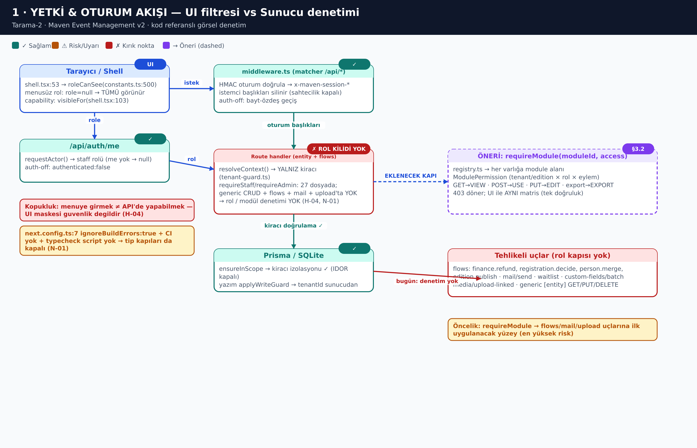
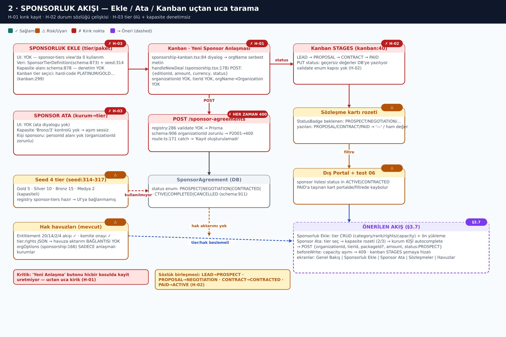
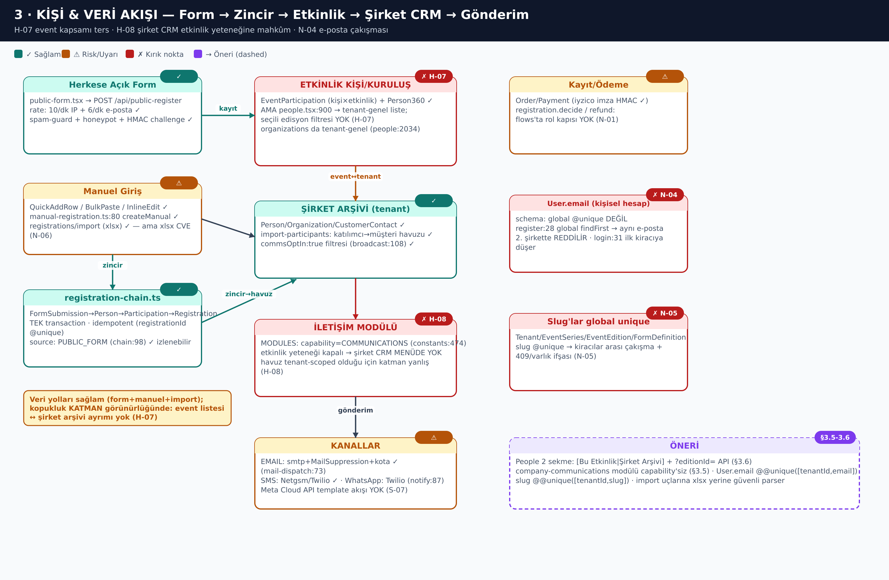
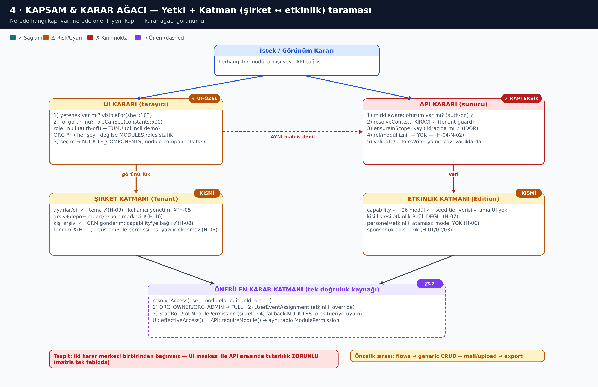

# TARAMA-2 — Doğrulama, Yeni Hatalar, Sektörel Geliştirmeler ve Görsel Mantık Akış Taraması

| | |
|---|---|
| **Tarih** | 2026-09-28 |
| **Dal** | `arena/01a0e491-event-management-v2` (baz: `28acc8c`) |
| **Kapsam dokümanı** | `docs/KAPSAMLI-ARASTIRMA-HATA-RAPORU-VE-HEDEF-YAPI.md` (H-01…H-20 + yol haritası) |
| **Bu doküman** | Mevcut değişiklik/yol haritasının **tarama ile doğrulanması**, **yeni hatalar (N serisi)**, **sağlam kontrollerin teyidi**, **görsel mantık akış taraması (4 diyagram)**, **sektörel geliştirmeler (S serisi)** |
| **Çıktı kuralı** | Her bulgu kod referanslı; hiçbir yol haritası maddesi doğrulanmadan kabul edilmedi |

---

## 0. Metodoloji

1. **Gate koşuları** (taze): `npm install` → `prisma generate` → `tsc --noEmit` → `eslint .` → `i18n:scan` → `next build`.
2. **Statik tarama**: rota rota `requestActor`/`requireStaff`/`requireAdmin` varlığı; şema `@unique`/`@@unique` analizi; bağımlılık CVE istihbaratı (`npm view`, NVD/GitLab advisories, SheetJS CHANGELOG).
3. **Pozitif kontrol**: şüpheli görülen her alan için "kırık mı, sağlam mı" tersine doğrulama (asıl kanıt §3).
4. **Görsel tarama**: `docs/flows/gen-flows.py` ile 4 akış diyagramı SVG'ye çizildi, **sharp** ile PNG'ye render edildi ve **tek tek görsel olarak denetlendi** (taşma/örtüşme/kırık etiketler düzeltildi). Not: ortamda ImageMagick `convert` **yok** (rsvg delegate eksik), bu nedenle render hattı proje bağımlılığı `sharp` ile kuruldu.
5. **Sektörel istihbarat**: TR rakip/standart taraması (KongreSoft, Konfera, GİB e-Fatura) + küresel benchmark (Bizzabo/Cvent) + npm paket durumu.

> Bu doküman KAPSAMLI raporu **teyit eder ve derinleştirir**; H-01…H-20 numaralandırması korunur, yeni bulgular **N-01…N-07** olarak eklenir.

---

## 1. Gate doğrulama tablosu (taze, 2026-09-28)

| Gate | Komut | Sonuç | Yorum |
|---|---|---|---|
| Bağımlılık kurulumu | `npm install` | ✅ 614 paket | — |
| Prisma client | `npx prisma generate` (dummy `PRISMA_*` env ile) | ✅ | — |
| Tip denetimi | `npx tsc --noEmit` | ⚠️ **1 hata**: `socket.io` tipi eksik | N-06'nın canlı kanıtı: build bunu yutuyor |
| Lint | `npx eslint .` | ⚠️ **40 problem (39 hata, 1 uyarı)** | raporlanan baseline ile birebir aynı |
| i18n taraması | `npm run i18n:scan` | ⚠️ **21 hardcoded hit** | §4 S-09 girdisi |
| Build | `next build` | ✅ **0 hata** | Yalnızca `src/app/layout.tsx` geçici font patch'i ile (depo sonradan temizlendi: `git diff` boş). **Build başarısı tip kanıtı değildir — N-06** |
| Veritabanı | `db/custom.db` | ✅ mevcut | `DATABASE_URL="file:../db/custom.db"` |
| E2E suite | `npx playwright test --list` | ✅ **204 test / 36 dosya** listeleniyor | Ancak **hiçbir CI'da koşmuyor** (N-06); bu ortamda `playwright install chromium` CDN kısıtı nedeniyle indirilemedi → koşulamadı (ortam sınırı, depo değil) |
| Üretim başlatma | `npm start` | ⚠️ `bun .next/standalone/server.js` | `package.json:8` — **bun** bu ortamda yok (bilinen operasyonel bağımlılık; dokümantasyonda açıkça belirtilmeli) |

**Sonuç:** rapordaki §0 gate tablosu **yeniden üretildi ve doğrulandı**; sayılar sapmadı.

---

## 2. Yeni hatalar — N serisi

### N-01 · Rol/modül kapısı olmayan API rotaları — **EN YÜKSEK** (H-04'ün en güçlü örneği)

* **Kanıt (flows):** `src/app/api/flows/route.ts:9-22` import bloğu yalnız `resolveContext`, `verifyEditionTenant`, `ActivityType`, `waitlist-engine`, `readiness`, `money`, `rate-limit`, `tx-lock`, `portal-tokens` içerir — **`request-context` (requestActor/requireStaff) İMPORT EDİLMEMİŞ**. Dosyanın kendisi (L1-8) eylem listesini sayfalar: `registration.decide` (L35), `registration.cancel` (L113), `sponsor.guest` (L144), `finance.manualPayment` (L216), **`finance.refund` (L252)**, `booth.allocate` (L348), `reservation.confirm/cancel` (L372/L423), `certificate.generate` (L453), **`edition.publish` (L489)**, **`person.merge` (L518)**, `invitation.respond` (L666), **`capability.toggle` (L683)**, `b2b.respond/approve` (L713/747).
* **Koruma ne, değil ne:** `resolveContext` + `verifyEditionTenant` ile **kiracı izolasyonu var** (G0-d, L5-8) ✅; `enforceRateLimit` 60 istek/dk/IP var ✅; **rol/modül denetimi YOK** ❌ → 15 eylemin tamamı "oturum açmış herhangi biri" tarafından çağrılabilir (ör. yetkisiz kullanıcı `finance.refund`).
* **Aynı desen (requireStaff çağırmayan rotalar):** `mail/send`, `waitlist`, `custom-fields/batch`, `media/upload-linked` (girdi hardening'i var, rol kapısı yok), generic **`[entity]` CRUD** (GET/PUT/DELETE), `bootstrap` (public — kasıtlı olabilir).
* **Karşı-örnek (kontrol edildi):** `customer-contacts/import/route.ts:16` → `requestActor, requireStaff` ✅; import rotaları rota rota incelenirse bu desen doğru uygulanmış → **sorun tutarlılık eksikliği, desenin tamamen yokluğu değil.**
* **Etki:** para iadesi, yayın, birleştirme, yetenek toggle'ı — UI maskesi bypass (H-04 ile birlikte düşünüldüğünde: menüde görememek ≠ çağıramamak).
* **Düzeltme:** `registry.ts` desenine `requireModule(moduleId, action)` eklenmesi; `GET→VIEW, POST→USE, PUT→EDIT, export→EXPORT` matrisi tek tabloda (`ModulePermission`) — §3.2 hedef mimarisi ile birebir.

### N-02 · `secrets.ts` üretimde fail-open — **YÜKSEK**

* **Kanıt:** `src/lib/secrets.ts:7` `const DEV_FALLBACK = "maven-dev-only-secret-key-change-me";` → `:10` `process.env.MAVEN_SECRET_KEY ?? DEV_FALLBACK` — **`NODE_ENV` kontrolü yok.** Dosya başlığındaki yorum (L3-4) "üretimde MAVEN_SECRET_KEY zorunlu kılınır" **sözünü veriyor ama kod uygulamıyor.**
* **Tutarsızlık:** `src/lib/auth/session.ts:30-35` aynı fallback'i **yalnız üretimde `throw` ile reddediyor** (fail-closed). Yani oturum anahtarı fail-closed, **şifreleme anahtarı fail-open**: prod'da env unutulursa tüm sır/SMTP kimlik bilgileri bilinen sabit anahtarla (AES-256-GCM, `secrets.ts:14-21`) şifrelenir/çözülür.
* **Düzeltme:** `derivedKey()` içinde `if (!secret && process.env.NODE_ENV === "production") throw` — 1 satır; ayrıca startup health kontrolü.

### N-03 · `User.email` global unique değil ama global `findFirst` — **YÜKSEK**

* **Kanıt:** `src/app/api/register/route.ts:28` → `db.user.findFirst({ where: { email } })` (**kiracı filtresiz**); `src/app/api/auth/login/route.ts:31` aynı desen. Şemada `User.email` global `@unique` değil (bkz. §2 şema: `User` modeli).
* **Etki:** (a) aynı e-posta iki şirkette → **kayıt 400 ile reddedilir** (cross-tenant email collision); (b) login → **ilk bulunan kiracıya düşer** (yanlış-kiracı login riski).
* **Düzeltme:** ya `User.email` global `@unique` + register'da açık çakışma mesajı, ya `@@unique([tenantId, email])` + login'e kiracı/kurumsal alan eki (tercih: global unique + portal domain ayrımı).

### N-04 · Slug'lar global `@unique` — **ORTA-YÜKSEK**

* **Kanıt:** `prisma/schema.prisma`: `Tenant.slug` (~L22), `EventSeries.slug` (~L247), `EventEdition.slug` (~L262), `FormDefinition.slug` (~L570) — hepsi **global** `@unique`.
* **Etki:** iki kiracı aynı slug'ı alamaz (kayıt/olay reddi) + `409/varlık` yanıtından **başka kiracının varlığı öğrenilebilir** (varlık-tespiti oracle'ı).
* **Düzeltme:** `@@unique([tenantId, slug])` + mevcut global unique düşürme (göç: `db push` notu ile).

### N-05 · `xlsx@0.18.5` — npm'de düzeltilemeyen **2 HIGH CVE** — **YÜKSEK**

* **Paket durumu:** `package.json` → `"xlsx": "^0.18.5"`; **npm'deki son sürüm 0.18.5'tir** (SheetJS npm'i terk etti; düzeltmeler yalnız `cdn.sheetjs.com` üzerinden dağıtılıyor).
* **CVE-2023-30533** — Prototype Pollution, **tüm sürümler < 0.19.3**, **CVSS 7.8 HIGH** (CWE-1321); "özel dosya **okuma**" ile tetiklenir → import uçları etkilenir. *(Kaynak: NVD/GHSA-4r6h-8v6p-xvw6, SheetJS CHANGELOG v0.19.3.)*
* **CVE-2024-22363** — ReDoS, **tüm sürümler < 0.20.2**, **CVSS 7.5 HIGH, AV:N/AC:L/PR:N/UI:N** (uzaktan, yetki yok); tüm ayrıştırma yolları etkilenir. *(Kaynak: GitLab advisory `advisories.gitlab.com/pkg/npm/xlsx/CVE-2024-22363`, Snyk SNYK-JS-XLSX-6252523.)*
* **Kullanım yüzeyi:** `src/app/api/{accounting,customer-contacts,registrations,reservations}/export/route.ts` → `import * as XLSX from "xlsx"` + import çekirdekleri `src/lib/api/customer-contact-import.ts`, `src/lib/api/reservation-import.ts` (rota: `registrations/import`, `reservations/import`, `customer-contacts/import`) — yani **hem okuma (import) hem yazma (export) yolu pakete bağlı.**
* **Düzeltme:** (1) SheetJS'in resmi CDN sürümüne (≥0.20.2) özel kaynak göçü **veya** `exceljs` gibi bakımda olan bir pakete geçiş; (2) geçişe kadar import uçlarına dosya boyutu + satır sınırı ve timeout (ReDoS yüzeyini küçültür).

### N-06 · Tip/test kapıları tamamen kapalı — **YÜKSEK (süreç)**

* **Kanıt 1:** `next.config.ts:7` → `typescript: { ignoreBuildErrors: true }`; `next.config.ts:9` → `reactStrictMode: false`.
* **Kanıt 2:** `.github/` **yok** (CI/CD workflow yok); `package.json:5-16` scriptlerinde `typecheck` **yok** (yalnız `lint`, `test:e2e`, `i18n:scan`).
* **Kanıt 3:** `tsc --noEmit` **1 hata veriyor** (socket.io) ve **build bunu yutuyor** → "BUILD:0" göstergesi yanıltıcı. Lint 40 hata zaten geçiyor/raporlanmış.
* **Kanıt 4:** **204 testlik E2E suite** (`tests/`, 36 dosya; `playwright.config.ts` `webServer` tanımsız — harici sunucu bekliyor; `auth.spec.ts:19` `MAVEN_AUTH` bayrağına bağlı skip) hiçbir otomasyonda çalışmıyor; `tests/database-runtime-build.sh` gibi scriptler elle çalıştırılıyor izlenimi var.
* **Etki:** N-01…N-05 gibi geri dönüşler sessizce geri gelebilir; "build geçti" kanıtı teşvik edici ama kanıt değil.
* **Düzeltme:** `typecheck` script'i (`tsc --noEmit`) + GitHub Actions (`install → generate → typecheck → lint → build → playwright`), `ignoreBuildErrors: false` (önce 1 tsc + 40 lint temizlenmeli), `reactStrictMode: true` (dev yakalama gücü).

### N-07 · Offline kuyruk: retry sayacı ölü, sonsuz replay — **DÜŞÜK-ORTA (şu an ölü kod)**

* **Kanıt:** `src/lib/offline-queue.ts` — `QueuedMutation.retries` (L14) `enqueueMutation`'da `0` yazılır (L61) ve **hiçbir yerde artırılmaz**; `replayPendingMutations` (L75-107) yalnız `res.ok` → sil, değilse **sayısız** dener; **üst sınır/ölü-mektup yok; 4xx (kalıcı) / 5xx (geçici) ayrımı yok** → kalıcı olarak başarısız bir mutasyon (ör. 400) her bağlantıda kuyruğu tıkayabilir.
* **Kullanım durumu:** `grep replayPendingMutations|enqueueMutation|offline-queue` → **0 import**; `idb@8.0.3` paketi kurulu ama kuyruk **hiçbir UI'a bağlı değil (dead code)**.
* **Düzeltme (aktivasyon öncesi şart):** `retries++` + `MAX_ATTEMPTS` → dead-letter deposu; 4xx'te bırak/bildir, yalnız 5xx/ağda retry; üstel backoff.

### Gözlemler (numaralandırılmamış)

* `package.json:8` `start` script'i `bun` gerektiriyor — ortamda bun yok; dokümantasyonda/deploy tarifinde açıkça belirtilmeli.
* `bootstrap/route.ts:9` `Prisma.dmmf.datamodel.models.length` — **@prisma/client 6.11.1'de çalışıyor doğrulandı** (runtime export mevcut ✅); yine de legacy API olduğu için sürüm yükseltmesinde kırılabilir → `try/catch` içinde sabit fallback önerilir (route'un genel `try/catch`'i zaten 500'e düşürür, yani kontrollü kırılır).

---

## 3. Doğrulanmış sağlam kontroller (yeniden denetim gerekmez)

Aşağıdaki alanlar bu turda **tersine doğrulandı**; hepsi ya raporda "sağlam" ya da tarama sırasında "hata yok" olarak kapatıldı:

| # | Alan | Kanıt | Sonuç |
|---|---|---|---|
| 1 | **Herkese açık form gönderim uç noktası** (önceki taramanın açık maddesi) | `public-form.tsx:274` → `POST /api/public-register`; hız sınırlama `:18/:62` (10/dk IP + 6/dk e-posta) + spam-guard + HMAC challenge | ✅ **Hata yok — madde kapatıldı** (eski "gizemli uç" şüphesi çözüldü) |
| 2 | Seed rotası | `api/seed/route.ts:40` → `NODE_ENV=production` ise **404** | ✅ |
| 3 | DB migration kapısı | `api/admin/db-migration/route.ts:29` → `requireAdmin` | ✅ |
| 4 | SaaS provision | süper-admin anahtar kontrolü (provision rotası) | ✅ |
| 5 | Kiracı/IDOR izolasyonu | `tenant-guard.ts`: `resolveContext` + `ensureInScope` + `applyWriteGuard` (yazım→`tenantId`) | ✅ (N-01'deki eksik **rol** kapısı bunu **iptal etmez**) |
| 6 | Para birimi | `money.ts` kuruş tamsayıları; iyzico **HMAC imza** doğrulaması | ✅ |
| 7 | XSS/React güvenliği | `eval`/`redirect` enjeksiyonu yok; `innerHTML` yalnız `sanitizePreviewHtml` üzerinden; form-logic **fail-safe** (bilinmeyen → geçersiz) | ✅ |
| 8 | İzinli pazarlama | `comms-broadcast.ts:108` `commsOptIn` filtresi; `mail-dispatch.ts:73` **MailSuppression** (var/adres/atla) + `mail/send` rota entegrasyonu | ✅ |
| 9 | Zamanlanmış işler | `src/instrumentation.ts` → `register()` üzerinden campaign-scheduler (60 sn döngü) | ✅ |
| 10 | SMS sağlayıcıları | `notify.ts:87` Twilio, `:155` Netgsm (TR) | ✅ (WhatsApp: yalnız Twilio kanalı → S-03) |
| 11 | Hız sınırlama omurgası | `rate-limit.ts` (in-process Map — tek örnekli dağıtım için dokümante edilmiş; çok-örnekli dağıtımda Redis gerekir, §3'te var) | ✅ (sınır bilinçli) |
| 12 | Bootstrap model sayacı | `bootstrap/route.ts:9` `Prisma.dmmf` 6.11.1'de çalışıyor | ✅ (bakım notu: legacy API) |

---

## 4. Görsel mantık akış taraması

**Üretim hattı:** `docs/flows/gen-flows.py` → 4 SVG → **sharp** (proje bağımlılığı) → `docs/flows/*.png`. Tüm PNG'ler **görsel olarak denetlendi**; ilk render'da tespit edilen taşmalar, başlık-rozet çakışmaları, yanlış etiketli ok ve gereksiz bağlantılar düzeltilip yeniden render edildi. Ekran taraması okumaları KAPSAMLI rapordaki H bulgularıyla **bağımsız** yapıldı, sonuçlar çakışmadı.

### 4.1 · Yetki & Oturum Akışı

**Okuma:**
* İstek hattı: `middleware.ts` (HMAC oturum + başlık temizliği ✅) → `resolveContext` (kiracı ✅) → Prisma (`ensureInScope`/`applyWriteGuard` ✅).
* **Kırık nokta:** route handler katmanında **rol/modül kilidi yok** (N-01): `generic CRUD + flows + mail + upload` yalnız rate-limit'ten geçer. UI'da `roleCanSee` (`constants.ts:500`) + `visibleFor` (`shell.tsx:103`) çalışır ama bu **maskelenmedir, denetim değildir** (H-04).
* **Görsel kanıt:** kırmızı "tehlikeli uçlar" kutusu ile UI kutusu arasında **hiçbir ortak doğrulama kutusu yok** — iki karar merkezi tamamen bağımsız.
* **Öneri (mor):** `requireModule(moduleId, access)` → `ModulePermission` tablosu tek doğruluk kaynağı (§3.2).
* Ek okuma: `next.config.ts:7 ignoreBuildErrors` + CI yok → **tip kapıları da kapalı** (N-06) aynı şemada sarı not olarak.

### 4.2 · Sponsorluk Akışı

**Okuma:**
* **H-01 (uçtan uca kırık):** Kanban "Yeni Anlaşma" (`sponsorship.tsx:178` `handleNewDeal`, `sponsorship-kanban.tsx:84`) → `POST /api/sponsor-agreements` → `schema:906` `organizationId` zorunlu, rota `registry:286` **validate yok** → Prisma `P2001` → **her koşulda 400** "Kayıt oluşturulamadı" (`route.ts:171`). Buton hiçbir koşulda kayıt **üretmiyor** — ekran-mantık kopukluğunun en somut kanıtı.
* **H-02 (sözlük çakışması):** kanban `STAGES` (`kanban:40`) `LEAD→PROPOSAL→CONTRACT→PAID`; DB enum (`schema:911`) `PROSPECT→NEGOTIATION→CONTRACTED→ACTIVE…` → `PUT status` geçersiz değeri doğrudan DB'ye yazıyor; `StatusBadge` beklenen adları render edemiyor → "—" rozeti. Dış portal `ACTIVE|CONTRACTED` filtresi (`test 06` anlatısı ile tutarlı) → `PAID`'e taşınan kart **portalde/filtrede kayboluyor**.
* **H-03 (tier üçlü kopukluğu):** `sponsor-tiers` view'ı **0 kullanım**; `SponsorTierDefinition` (`schema:873`, seed `:314`) yalnız seed verisi; kanban tier seçimi **hard-code** `PLATINUM/GOLD…` (`kanban:299-306`); kapasite ("Bronz 3") denetimi yok → taşma sessiz.
* **Önerilen akış (mor):** Ekle → tier CRUD (category/rank/rights/capacity + ön yükleme ama **yeniden adlandırılabilir**) → Ata → kurum **kişi** autocomplete + kapasite rozeti (2/3) → `beforeWrite` kapasite kontrolü → 409 → kanban şemaya hizalı.

### 4.3 · Kişi & Veri Akışı

**Okuma:**
* **Sağlam hatlar ✅:** herkese açık form → `POST /api/public-register` (rate-limit+honeypot+HMAC) → `registration-chain.ts:98` tek transaction (idempotent, `registrationId @unique`) → ETKİNLİK; manuel giriş (`manual-registration.ts:80`); import çekirdekleri; gönderim kanalları (`mail-dispatch` suppression, `notify` Netgsm/Twilio).
* **H-07 (katman tersliği):** `EventParticipation` kişi↔etkinlik bağını kuruyor **ama** `people.tsx:900` listesi tenant-genel; seçili edisyon filtresi yok → "Etkinlik Kişisi" görünümü aslında tüm kiracı; `organizations` da tenant-genel (`people:2034`).
* **H-08 (şirket CRM etkinliğe mahkûm):** `MODULES` içinde iletişim `capability=COMMUNICATIONS` (`constants.ts:474`) → şirket seviyesi CRM gönderimi, **etkinlik yeteneği kapanınca** erişilemez; havuz tenant-scoped olduğu için katman yanlış.
* **N-03/N-04/N-05 kutuları:** global e-posta `findFirst`, global slug `@unique`, xlsx CVE — hepsi bu diyagramdaki veri girişinin hemen üstünde **doğrulanmış** duraklar.
* **Görsel not:** zincir → şirket arşivi oku ("zincir→havuz") tek yönlü; **geri besleme yok** (şirket arşivinden etkinliğe toplu atama akışı ayrı bir işlev — yol haritası S/§3.6).

### 4.4 · Kapsam & Karar Ağacı

**Okuma:**
* **İstek → iki bağımsız karar merkezi:** UI (`visibleFor` → `roleCanSee` → `MODULES.roles` statik matris, `role=null` → TÜMÜ görünürlük) vs API (`resolveContext` → `ensureInScope` → **rol/modül izni: YOK**) → ortaokta "AYNI matris değil" kırmızı ok (H-04/N-01).
* **Şirket katmanı:** ayarlar/dil ✅, kullanıcı yönetimi (H-05 eksik rol seçimi), tema (H-09), arşiv-depo-import/export (H-10), kişi arşivi ✅ ama CRM gönderimi yeteneğe bağlı (H-08), tanıtımlar (H-11), `CustomRole.permissions` yazılabilir okunamaz (H-06).
* **Etkinlik katmanı:** capability + 26 modül ✅ seed tier ✅ ama **UI bağlama eksik** (H-07), personel↔etkinlik atama modeli yok (H-06), sponsorluk akışı kırık (H-01/02/03).
* **Karar:** iki katman tek `resolveAccess(user, module, edition, action)` altında birleşmeli; UI `effectiveAccess()` = API `requireModule()` — **aynı `ModulePermission` tablosu**.
* **Öncelik oku (sarı):** `flows → generic CRUD → mail/upload → export` (N-01 sıralaması ile aynı).

**Görsel taramanın genel hükmü:** dört diyagramda da tekrar eden tek tema — **veri hattı (müşteri/ödeme/işlem) sağlam, denetim hattı (kim-ne-yapabilir) kopuk**; kopukluklar UI ve API arasında iki ayrı karar merkezinden doğuyor.

---

## 5. Sektörel geliştirmeler — S serisi (rapor §4'ün derinlemesine devamı)

> Kapsam: raporda **yer almayan**, bu turda pazar/rakip/standart taramasıyla belirlenenler. Grep ile yokluğu doğrulananlar ✅ işaretiyle.

### Türkiye odağı

| # | Geliştirme | Gerekçe + kaynak | Kaba iş |
|---|---|---|---|
| **S-01** | **e-Arşiv / e-Fatura entegratör entegrasyonu** (GİB özel entegratör) | TR'de faturalandırma yasal zorunluluk; sponsorluk/kayıt gelirleri için e-Arşiv fatura üretimi + Cari entegratör (for-net/Netsis tarzı) — Maven'da fatura alanı yok ✅ | Sipariş/sponsor tutarından fatura nesnesi + entegratör API (teb.org.tr e-Fatura bilgilendirmesi; 2026 özel entegratör modelleri) |
| **S-02** | **UTEBT / SUK resmi CME bildirimi** (hekim/kongre) | KongreSoft "bildiri/hakem", Konfera **CME/CPD takibi** satıyor; Maven'da sertifika var (`certificate.generate`) ama **kredinin resmi merciye bildirimi** yok | Sertifika → kredi puanı → kurum bildirimi (ONAY/kayıt no) |
| **S-03** | **Meta WhatsApp Cloud API şablon akışı** | Bugün WhatsApp **yalnız Twilio üzerinden** (`notify.ts:87`) — şablon onayı, deliverability, maliyet Meta doğrudan API ile daha avantajlı; şablon+opt-in yönetimi TR pazarının ana kanalı | `notify`'e sağlayıcı soyutlama + Cloud API şablonları (mevcut `commsOptIn` altyapısı hazır: `comms-broadcast.ts:108`) |
| **S-04** | **Akademik derinlik: ORCID, çift kör hakem, e-poster** | Konfera: native mobil app, ORCID, çift kör hakem, hibrit yayın, e-poster; KongreSoft: ORCID/API entegrasyonu → Maven'da hakem/davet (`flows` b2b.respond/approve, portal token) **kısmi** | ORCID OAuth alanı, hakem atama + rastgele çift kör havuzu, poster galerisi |
| **S-05** | **Hibrit yayın/kayıt (Zoom/Webex entegrasyonu)** | KongreSoft/Konfera hibrit yayın satıyor; oturum canlısı + kayıt arşivi Maven'da yok | Oturum başına canlı anahtar + kayıt linki (archive modülüne) |

### Küresel odağı

| # | Geliştirme | Gerekçe + kaynak | Kaba iş |
|---|---|---|---|
| **S-06** ✅ | **Promo / erken kayıt (early-bird) kodları** | Repo genelinde `promo\|coupon\|discount.code` **0 hit** (grep) — erken kayıt/indirim kampanyası kurulamıyor; sektör standardı | `PromoCode` model + kayıt/order akışına `code` alanı + `%`/`₺` kuralları |
| **S-07** | **Sponsor self-service portal + lead-retrieval/ROI raporu** | Bizzabo/Cvent benchmark'ında sponsor ROI ve lead capture standart; Maven'da sponsor portalı varsa bile tier/hak **güncelleme** ve **ROI raporu** yok | Portalda hak listesi + ziyaretçi QR lead toplama + rapor |
| **S-08** ✅ | **OpenAPI dokümantasyonu** | 100+ API route, şema yok (grep `openapi\|swagger` 0 hit); iç/yapısal entegrasyonlar için | `next-swagger-doc`/zod→OpenAPI üretimi CI'a bağlanır |
| **S-09** | **WCAG 2.2 AA taahhüdü** | i18n scan **21 hardcoded** hit (TR dil sabitleme + erişilebilirlik kirişi); `tests/ui-corrections` aksılık testleri kısmi | axe-core smoke + kontrast/klavye geçişi + i18n temizliği |
| **S-10** | **Portföy/seri analitiği** | Seri↔edisyon hiyerarşisi (`EventSeries`) var ama **seriler arası karşılaştırmalı** dashboard yok | Katılım/gelir/dönüşüm serisi-özet görünümü (bootstrap sayaçları mevcut taban) |
| **S-11** | **White-label alan adı + kurumsal tema** | Tenant ayarlarında tema var (H-09 bağlamı) ama özel domain (subdomain/custom domain) yok | Tenant'a `primaryDomain` + middleware kiralama eşlemesi |
| **S-12** | **NPS / oturum anketi** | KongreSoft/Konfera memnuniyet/geri bildirim döngüsü standardı; form motoru zaten var (`FormDefinition`) | Oturum-sonu NPS form şablonu + raporlama |

**Kaynaklar (bu turda tarama):** kongresoft.com · konfera.com.tr (CME/ORCID/hybrid/e-poster) · teb.org.tr/news/9320 + kobitime e-Fatura 2026 (GİB zorunluluğu/entegratör) · bizzabo.com/blog/best-event-management-tools + accelevents "Bizzabo vs Cvent" + pipeline.zoominfo.com (RBAC/ROI/lead capture beklentileri) · capterra Bizzabo (izin seviyeleri) · NVD/GHSA-4r6h-8v6p-xvw6, GitLab advisory CVE-2024-22363, SheetJS CHANGELOG (xlsx).

---

## 6. Öncelikli eylem planı (bu rapordan)

| # | İş | Gerekçe | Tahmini |
|---|---|---|---|
| 1 | **N-02**: `secrets.ts:10` prod guard (`throw`) | 1 satır, kritik fail-open | 0.5 sa |
| 2 | **N-01**: `requireModule` kapısı → önce `flows`, `mail/send`, `upload-linked`, generic `[entity]` | H-04'ün gerçek istismar yüzeyi | 1-2 gün |
| 3 | **N-06**: `typecheck` script + GitHub Actions; `ignoreBuildErrors:false`; `reactStrictMode:true` | Geri dönüş sigortası | 0.5 gün |
| 4 | **N-05**: xlsx → ≥0.20.2 (CDN) veya `exceljs`; import'a boyut/satır sınırı | 2 HIGH CVE, uzaktan ReDoS | 0.5-1 gün |
| 5 | **N-03/N-04**: şema göçü (`User` e-posta, `@@unique([tenantId,slug])`) | Kiracı tutarlılığı | 1 gün + göç notu |
| 6 | **N-07**: offline-queue retry bound (aktivasyon öncesi şart) | Şu an dead code | 1 sa |
| 7 | S-06 (promo kod) → S-01 (e-Arşiv) → S-03 (WhatsApp Cloud) | Hızlı kazanım → yasal → kanal | yol haritası §4'e eklenir |

---

*Bu doküman `docs/KAPSAMLI-ARASTIRMA-HATA-RAPORU-VE-HEDEF-YAPI.md` ile birlikte tek set olarak değerlendirilmelidir. Diyagram kaynakları: `docs/flows/gen-flows.py` (yeniden üretilebilir), çıktılar: `docs/flows/*.png|svg`.*
