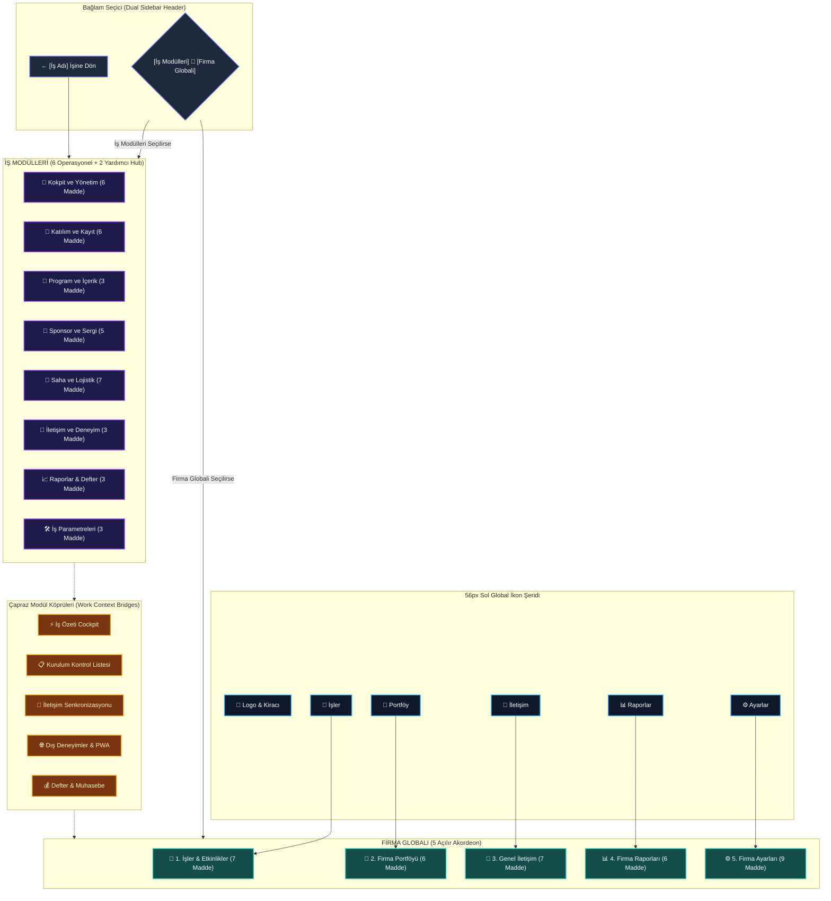
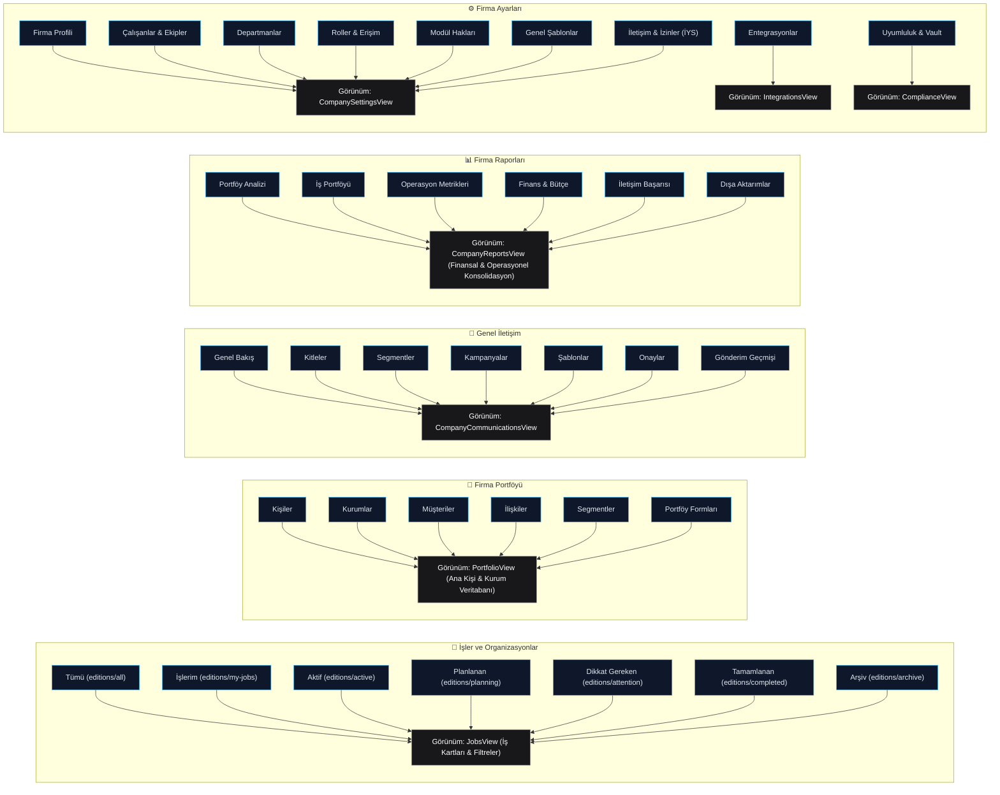

# 🗺️ Maven Event Management V2 — Menü Mimarisi ve Bağlantı Şeması

> **Obsidian Görsel Rehberi:** Bu dosya hem Obsidian Graph View hem de canlı Canvas/Mermaid render motoru ile tam uyumlu olarak tasarlanmıştır.

#maven-v2 #mimari #menu-hiyerarsisi #firma-globali #is-modulleri #baglam-koprusu

---

## 🧭 1. Genel Mimari ve Çift Sol Menü (Dual Sidebar) Şeması

---

## 🏢 2. [[Firma Globali]] Detaylı Menü Ağacı ve Ekran Bağlantıları

> [!info] **Firma Globali Kapsamı**
> Kiracı organizasyonun (Firma B) tüm etkinliklerden bağımsız olan kalıcı varlıklarını, genel iletişimini ve konsolide raporlarını içerir. 5 ana akordeon ve 36 alt maddeden oluşur.

---

## 🎯 3. [[İş Modülleri]] Sektörel Hub'ları ve Ekran Bağlantıları

> [!info] **İş Modülleri Kapsamı (Work Workspace)**
> Yalnızca seçili işe (Kongre, Fuar, Kurumsal Etkinlik) ait operasyonel süreçleri içerir. 6 Sektörel Operasyonel Hub ve 2 Yardımcı Hub'da toplam 33 alt madde yer alır.

```mermaid
flowchart LR
    classDef hub fill:#312e81,stroke:#818cf8,stroke-width:2px,color:#ffffff;
    classDef item fill:#1e1b4b,stroke:#c084fc,stroke-width:1px,color:#f5f3ff;
    classDef mod fill:#0f172a,stroke:#38bdf8,stroke-width:1px,color:#f8fafc;

    subgraph HUB_1["🎯 1. Kokpit ve Yönetim"]
        H1_1["İş Özeti"]:::item --> M_DASH["Modül: Dashboard / Kokpit"]:::mod
        H1_2["Kurulum Kontrol Listesi"]:::item --> M_SETUP["Modül: SetupChecklistCard"]:::mod
        H1_3["Görevler ve Onaylar"]:::item --> M_OPS["Modül: Operations & Tasks"]:::mod
        H1_4["Müşteri ve Düzenleyen"]:::item --> M_ORGS["Modül: Organizations"]:::mod
        H1_5["Ekip ve Yetkiler"]:::item --> M_SETS["Modül: Work Settings"]:::mod
        H1_6["İş Bilgileri"]:::item --> M_ED["Modül: Editions Editörü"]:::mod
    end

    subgraph HUB_2["📝 2. Katılım ve Kayıt"]
        H2_1["Katılımcılar"]:::item --> M_REG["Modül: Registrations (Liste & Detay)"]:::mod
        H2_2["Kategoriler ve Haklar"]:::item --> M_REG_CAT["Modül: Registrations (Kategoriler)"]:::mod
        H2_3["Onay Merkezi"]:::item --> M_REG_APP["Modül: Registrations (Onay Kuyruğu)"]:::mod
        H2_4["Formlar"]:::item --> M_FORMS["Modül: FormCenter"]:::mod
        H2_5["İçe / Dışa Aktarım"]:::item --> M_REG_IMP["Modül: Registrations (Aktarım)"]:::mod
        H2_6["Kişiler ve Kurumlar"]:::item --> M_PEOPLE["Modül: People (İşe Bağlılar)"]:::mod
    end

    subgraph HUB_3["📅 3. Program ve İçerik"]
        H3_1["Program (Oturumlar)"]:::item --> M_PROG["Modül: Scientific (Program Izgarası)"]:::mod
        H3_2["Bilimsel (Bildiriler)"]:::item --> M_SCI["Modül: Scientific (Bildiri & Hakem)"]:::mod
        H3_3["Sosyal ve Tur Planı"]:::item --> M_SOC["Modül: Social (Gala, Turlar)"]:::mod
    end

    subgraph HUB_4["💎 4. Sponsor ve Sergi"]
        H4_1["Sponsorlar"]:::item --> M_SPON["Modül: Sponsorship (Kanban & Paket)"]:::mod
        H4_2["Paketler ve Anlaşmalar"]:::item --> M_SPON
        H4_3["Haklar ve Teslimatlar"]:::item --> M_SPON
        H4_4["Stantlar / Floor Studio"]:::item --> M_FLOOR["Modül: Floors (SVG Yerleşim)"]:::mod
        H4_5["B2B İkili Görüşmeler"]:::item --> M_B2B["Modül: B2B Eşleşme Masası"]:::mod
    end

    subgraph HUB_5["🚚 5. Saha ve Lojistik"]
        H5_1["Saha Operasyonu"]:::item --> M_ONSITE["Modül: Onsite (Canlı Check-in & Kiosk)"]:::mod
        H5_2["Yaka Kartları ve Baskı"]:::item --> M_BADGE["Modül: BadgeQueue (Termal ZPL Baskı)"]:::mod
        H5_3["Belgeler ve Sertifikalar"]:::item --> M_CERT["Modül: Certificates"]:::mod
        H5_4["Konaklama"]:::item --> M_ACC["Modül: Accommodation (Otel Blokları)"]:::mod
        H5_5["Seyahat ve Transfer"]:::item --> M_ACC_TR["Modül: Accommodation (Uçuş & Araç)"]:::mod
        H5_6["Mekânlar ve Alanlar"]:::item --> M_FLOOR
        H5_7["Ek Hizmetler"]:::item --> M_FIN["Modül: Finance (Ek Hizmet Kalemleri)"]:::mod
    end

    subgraph HUB_6["📡 6. İletişim ve Deneyim"]
        H6_1["İş İletişimi"]:::item --> M_COMMS["Modül: Communications (İş Kitleleri)"]:::mod
        H6_2["Dış Deneyimler (Portallar)"]:::item --> M_PORTAL["Modül: Portals (PWA & Web Vitrini)"]:::mod
        H6_3["Medya Arşivi"]:::item --> M_MEDIA["Modül: Media"]:::mod
    end

    subgraph HUB_7["📈 7. İş Raporları (Yardımcı)"]
        H7_1["Finans & Defter"]:::item --> M_ACC_LEDGER["Modül: Accounting (Gelir/Gider Defteri)"]:::mod
        H7_2["Kayıt İstatistikleri"]:::item --> M_REG
        H7_3["Sponsor ROI Raporu"]:::item --> M_SPON
    end

    subgraph HUB_8["🛠️ 8. İş Ayarları (Yardımcı)"]
        H8_1["İş Parametreleri"]:::item --> M_SETS
        H8_2["Etkin Modüller"]:::item --> M_SETS
        H8_3["Yayın & Dış Görünüm"]:::item --> M_PORTAL
    end
```

---

## 🔗 4. [[Bağlam Köprüsü]] (Module Context Bridge) Akışları

İş bağlamı açıkken üst barda yer alan 5 kritik geçiş köprüsü:

| Köprü Adı | Temsil Edilen Simge | Hedef Modül | Alt Görünüm | İşlev & Çapraz Bağlantı |
| :--- | :---: | :--- | :--- | :--- |
| **İş Özeti** | ⚡ | `dashboard` | `null` | Anlık iş sağlık puanı, blokajlar ve hızlı aksiyon kokpiti. |
| **Kurulum Listesi** | 📋 | `editions` | `setup-checklist` | Kademeli kurulum adımları ve yayın blokaj denetimi. |
| **İş İletişimi** | 📨 | `communications` | `overview` | Yalnızca bu işin delegelerine özel duyuru merkezi (Firma geneline köprü sağlar). |
| **Dış Deneyimler** | 🌐 | `portals` | `pwa` | Katılımcı PWA vitrini, konuşmacı portalı ve sponsor alanı. |
| **İş Raporları** | 💰 | `accounting` | `defter` | İşe ait tek düzen gelir-gider defteri ve kapanış mutabakatı. |

---

## 📑 5. Obsidian İç Bağlantı Dizini (Backlinks)

- [[Firma Globali]]
  - [[İşler ve Organizasyonlar]]
  - [[Firma Portföyü]]
  - [[Genel İletişim]]
  - [[Firma Raporları]]
  - [[Firma Ayarları]]
- [[İş Modülleri]]
  - [[Kokpit ve Yönetim]]
  - [[Katılım ve Kayıt]]
  - [[Program ve İçerik]]
  - [[Sponsor ve Sergi]]
  - [[Saha ve Lojistik]]
  - [[İletişim ve Deneyim]]
  - [[İş Raporları]]
  - [[İş Ayarları]]
- [[Bağlam Köprüsü]]
- [[Yeni İş Sihirbazı (New Work Wizard)]]
- [[Kurulum Kontrol Listesi]]
